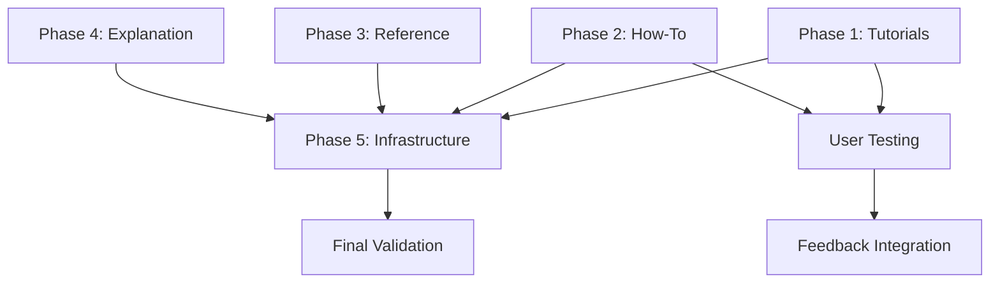

# Design Document: Agent OS Enhanced Documentation Restructure

**Date**: 2025-10-10  
**Status**: Draft  
**Author**: AI Analysis  
**Reviewers**: Josh (Product Owner)

---

## Executive Summary

This design document outlines a comprehensive restructuring of Agent OS Enhanced documentation to align with the [Divio Documentation System](https://docs.divio.com/documentation-system/), addressing critical gaps identified through systematic analysis. The current documentation achieves 46% Divio compliance with **zero tutorials**, inadequate how-to guides, and mixed content types. This restructure will increase compliance to 90%+, dramatically improving user onboarding, retention, and support efficiency.

**Key Metrics**:
- Current state: 46% Divio compliance (heavily skewed toward explanation)
- Target state: 90%+ Divio compliance (balanced across all 4 types)
- Estimated effort: 50-60 hours
- Timeline: 6 weeks
- **Impact**: Reduce user abandonment, decrease support burden, increase adoption

---

## 0. Background & Context

### 0.1 What is Agent OS Enhanced?

**Agent OS Enhanced** is a portable multi-agent development framework designed for AI-assisted development. It enables AI agents (like Claude in Cursor) to build high-quality software systematically through structured workflows, semantic knowledge retrieval, and quality enforcement gates.

**Core Innovation**: Treats AI as the primary consumer of documentation, with humans as orchestrators who provide direction and approval, while AI writes 100% of the code.

**Key Components**:
1. **MCP RAG Server**: Semantic search over standards with 90% context reduction
2. **Universal + Generated Standards**: Timeless CS principles adapted to specific languages
3. **Phase-Gated Workflows**: Evidence-based sequential execution patterns
4. **Command Language**: Binding symbols for deterministic LLM behavior
5. **Quality Gates**: Pre-commit hooks + iteration loops enforce standards

### 0.2 Human-AI Partnership Model

**Operating Model**:

| Human Role (Orchestrator) | AI Role (Code Author) |
|---------------------------|------------------------|
| Provide direction | Write 100% of code |
| Ask questions | Create/modify files |
| Make decisions | Implement functions |
| Review outcomes | Write tests |
| Identify issues | Fix linting/test errors |
| Approve deliverables | Iterate until quality gates pass |

**NOT a copilot relationship** - AI is the primary author, human guides and validates.

**Workflow Pattern**:
1. Human: "We need feature X with Y requirements"
2. AI: Queries standards → Creates spec → Implements → Tests → Fixes issues → Presents for review
3. Human: Reviews, provides feedback or approves
4. Repeat until quality gates pass and human approves

### 0.3 Technical Architecture

#### 0.3.1 MCP/RAG Architecture

**Problem Solved**: Traditional approach requires AI to load entire 50KB documentation files (96% noise, 4% relevant). This wastes context window, degrades attention, and slows generation.

**Solution**: Model Context Protocol (MCP) + Retrieval Augmented Generation (RAG)

**How it Works**:
1. **Documentation Chunking**: All standards/workflows chunked by semantic boundaries (headers, sections)
2. **Vector Embeddings**: Each chunk converted to vector embedding (LanceDB)
3. **Semantic Search**: AI queries via `search_standards` MCP tool with natural language
4. **Targeted Results**: Returns 2-5KB of relevant chunks (vs 50KB full file)
5. **90% Context Reduction**: AI gets exactly what it needs, nothing more

**Real-Time Updates**: File watcher monitors `.agent-os/standards/` and `.agent-os/workflows/`:
- Detects modifications, creations, deletions
- Triggers incremental RAG index update
- Changes queryable within 10-30 seconds
- No manual rebuild required

**Example**:
```
Without RAG: Load python-concurrency.md (50KB) → 96% irrelevant
With RAG:    Query "How do I use threading locks?" → 2KB targeted chunk
Result:      50KB → 2KB = 96% reduction, 20x efficiency
```

#### 0.3.2 Universal + Generated Standards

**Two-Tier Knowledge Base**:

**Tier 1: Universal Standards** (Language-agnostic CS fundamentals)
- Concurrency (race conditions, deadlocks, synchronization)
- Architecture (SOLID, DRY, separation of concerns)
- Testing (unit, integration, test pyramid)
- Failure Modes (error handling, retries, circuit breakers)
- Security (credential handling, input validation, encryption)
- Database (transactions, indexing, query optimization)

**Tier 2: Language-Specific Generated Standards** (Adapted implementations)
- Python: GIL implications, `threading` vs `asyncio`, `pytest` patterns
- Go: Goroutines, channels, `sync` package, table-driven tests
- JavaScript: Event loop, Promises, `async/await`, Jest patterns
- Rust: Ownership model, `Arc<Mutex<T>>`, fearless concurrency

**Generation Process**:
1. AI reads universal standard (e.g., concurrency fundamentals)
2. AI reads language instruction (e.g., `language-instructions/python.md`)
3. AI generates language-specific standard with code examples
4. File watcher indexes generated standard immediately
5. AI can now query language-specific guidance

**Example Transformation**:
```
Universal: "Use locks to protect shared mutable state"
↓
Python: "Use threading.Lock() with context manager to protect shared state
         Beware: GIL means threading is good for I/O, multiprocessing for CPU"
↓
Go: "Use sync.Mutex or channels to protect shared state
     Goroutines can truly parallelize, unlike Python threads"
```

#### 0.3.3 Phase-Gated Workflows

**Problem**: LLMs are non-deterministic and prone to skipping steps, hallucinating, or producing inconsistent outputs.

**Solution**: Structured workflows with mandatory checkpoints and evidence-based validation.

**Three-Tier Architecture** (for documentation files):
- **Tier 1 (≤100 lines)**: Task files - side-loaded for optimal LLM attention
- **Tier 2 (200-500 lines)**: Phase files - actively read for comprehensive context  
- **Tier 3 (unlimited)**: Output artifacts - generated results

**Rationale**: Research shows LLMs have degraded attention beyond 100 lines. Small files maximize compliance.

**Workflow Structure**:
```
workflow_name_v1/
├── metadata.json              # Workflow config
└── phases/
    ├── 0/                     # Optional Phase 0
    │   ├── phase.md          # Phase overview (~80 lines)
    │   ├── task-1-name.md    # Task 1 (≤100 lines)
    │   └── task-2-name.md    # Task 2 (≤100 lines)
    ├── 1/
    │   ├── phase.md
    │   └── task-1-name.md
    └── 2/
        ├── phase.md
        └── task-1-name.md
```

**Phase Gating Mechanism**:
1. AI starts workflow via `start_workflow` MCP tool
2. Receives Phase 0 content only (cannot skip ahead)
3. Completes phase tasks
4. Submits evidence via `complete_phase` tool
5. **Checkpoint Validation**: Evidence checked against criteria
   - ✅ Pass: Advance to next phase, receive new content
   - ❌ Fail: Return missing evidence, remain in current phase
6. Repeat until workflow complete

**Evidence-Based Checkpoints** (examples):
- Phase 1 (Requirements): Must have ≥3 functional requirements, ≥1 user story
- Phase 2 (Design): Must have architecture diagram, data models, API specs
- Phase 3 (Implementation): Must have passing tests, zero linter errors

**State Persistence**: Workflow state stored in `.agent-os/.cache/workflow_state.json`:
- Current phase
- Completed phases
- Evidence submitted
- Artifacts created
- Can resume after interruption

#### 0.3.4 Command Language

**Problem**: LLMs often ignore instructions, skip steps, or summarize when they should paste verbatim.

**Solution**: Command language with binding symbols that create strong obligations.

**Command Categories**:

**🛑 Blocking Commands** (Cannot proceed until executed)
- `🛑 EXECUTE-NOW: [command]` - Run command, paste output verbatim
- `🛑 PASTE-OUTPUT` - Copy-paste exact output, no interpretation
- `🛑 READ-FILE: [path]` - Read file before proceeding

**📊 Evidence Commands** (Must provide metrics)
- `📊 COUNT-AND-DOCUMENT: [what]` - Count items, show total
- `📊 LIST-ALL: [what]` - Enumerate all items, no omissions

**⚠️ Warning Commands** (Strong guidance)
- `⚠️ DO-NOT: [action]` - Explicit prohibition
- `⚠️ REQUIRED: [what]` - Non-negotiable requirement

**🎯 Navigation Commands** (Explicit routing)
- `🎯 NEXT-PHASE: [number]` - Advance to next phase
- `🎯 RETURN-TO: [phase]` - Return to specific phase

**Enforcement**: Commands are recognized by AI and create stronger compliance than natural language instructions. Symbol + verb creates cognitive anchor.

#### 0.3.5 Quality Enforcement System

**Multi-Layer Quality Gates**:

**Layer 1: Standards (Preventive)**
- AI queries standards BEFORE generating code
- "What are race conditions to avoid?"
- "How should I structure tests?"
- Goal: Get it right the first time

**Layer 2: Iteration Loop (Corrective)**
- AI generates code
- Runs tests/linters
- Sees failures
- Fixes issues iteratively
- Repeats until passing
- Goal: Self-guided improvement

**Layer 3: Pre-Commit Hooks (Final Gate)**
- Executable specifications that run before commit
- Validate docstrings, credential safety, git safety, YAML syntax, workflow metadata, installation docs
- ❌ Fail: Commit blocked, AI must fix
- ✅ Pass: Commit allowed
- Goal: Zero defects in commits

**Pre-Commit Hook Examples**:
```bash
# scripts/pre-commit/validate-credential-safety.sh
# Checks: No hardcoded credentials, .env usage enforced

# scripts/pre-commit/validate-no-mocks-integration.sh  
# Checks: Integration tests use real services (dogfooding)

# scripts/pre-commit/validate-workflow-metadata.sh
# Checks: metadata.json valid, has required fields
```

**Iteration Loop Pattern**:
```
1. AI writes code
2. AI runs: pytest tests/
3. See: 5 tests failed
4. AI analyzes failures
5. AI fixes code
6. AI runs: pytest tests/
7. See: 2 tests failed
8. AI fixes remaining issues
9. AI runs: pytest tests/
10. See: All tests passed ✅
11. AI runs: ruff check .
12. See: 3 linting errors
13. AI fixes linting
14. AI runs: ruff check .
15. See: No errors ✅
16. AI attempts commit
17. Pre-commit hooks run
18. See: 1 hook failed (missing docstring)
19. AI adds docstring
20. AI attempts commit
21. All hooks pass ✅
22. Commit succeeds
```

**Result**: High-quality code with minimal human intervention.

### 0.4 Context Efficiency & Discovery

#### 0.4.1 Context Efficiency

**90% Context Reduction**:
- Traditional: Load 50KB file → AI distracted by 96% irrelevant content
- Agent OS: Query RAG → Get 2-5KB targeted chunks → AI focuses on 95% relevant content

**Why This Matters**:
1. **Token Cost**: 50KB → 2KB = 25x cost reduction per query
2. **Attention Quality**: LLMs degrade with long context, focused context improves accuracy
3. **Generation Speed**: Less input = faster output
4. **Accuracy**: Targeted info reduces hallucination risk

**Measured Impact** (from internal case study):
- Python SDK project: 3-8x commit velocity increase
- Framework design: 20-40x faster (hours vs days)
- Quality: Maintained with pre-commit hooks

#### 0.4.2 Discovery Flow Architecture

**How Users Navigate Documentation**:

```
Entry Point (README.md)
    ↓
Compliance Gate (Must query standards before action)
    ↓
Standards Hub (Universal + Language-Specific)
    ↓
Framework Hub (Workflows for complex tasks)
    ↓
Side-Loaded Context (Task files ≤100 lines)
```

**Discovery Patterns**:
1. **New User**: README → Intro → Installation → First Tutorial
2. **Developer**: Problem → Search Standards → Apply Guidance
3. **Complex Task**: Decision → Start Workflow → Follow Phases
4. **Customization**: Need → Create Custom Standard → Query to Verify

**Problem with Current Docs**: Discovery path unclear, no tutorials, mixed content types confuse users.

### 0.5 Dogfooding Principle

**Agent OS is Built Using Agent OS**:

**Why This Matters**:
1. **Validates Framework**: If Agent OS can build itself, framework works
2. **Ensures Accuracy**: Docs must be accurate because we depend on them
3. **Improves Continuously**: Pain points we hit, users will hit - we fix them
4. **Quality Guarantee**: Pre-commit hooks enforced on our code too

**Practical Impact**:
- Installation experience matches consumers (we follow same steps)
- Standards tested in real development (not theoretical)
- Workflows battle-tested (we use them daily)
- Documentation accuracy critical (we rely on it)

**Example**: When creating this design doc:
1. Query: "design document structure specifications template"
2. Get: Spec creation workflow guidance
3. Apply: Use Agent OS's own framework to structure this doc
4. Result: Doc follows same patterns we recommend

### 0.6 Problem This Documentation Restructure Solves

**Core Issue**: Agent OS Enhanced has excellent *explanation* documentation but lacks *tutorials* and *how-to guides*, creating high user abandonment and support burden.

**Why This Happens**: Common documentation anti-pattern - creators explain what they built but don't teach how to use it or solve specific problems.

**Impact**:
- Users install Agent OS → Don't know how to use it → Abandon
- Experienced users hit problems → Can't find answers → Support tickets
- Documentation doesn't match Divio best practices → Poor user experience

**This Project**: Restructure documentation following Divio framework to create balanced, usable documentation that serves users at every stage of their journey.

**Success = Documentation that enables AI agents to autonomously build high-quality software with Agent OS Enhanced.**

### 0.7 Using Agent OS Enhanced for This Project

**This documentation restructure project will itself use Agent OS Enhanced workflows**, demonstrating dogfooding in action.

#### 0.7.1 Workflow Sequence

**Step 1: Specification Creation** (This design doc → Formal spec)
- Use: `spec_creation_v1` workflow
- Input: This design document as supporting document (Phase 0)
- Output: 
  - `srd.md` - Software Requirements Document
  - `specs.md` - Technical Specifications
  - `tasks.md` - Implementation Plan
  - `implementation.md` - Implementation Details
- Location: `.agent-os/specs/2025-10-10-divio-docs-restructure/`

**Step 2: Specification Execution** (Implement the spec)
- Use: `spec_execution_v1` workflow  
- Input: Specifications from Step 1
- Process:
  - Phase 1: Setup & scaffolding
  - Phase 2: Core implementation (tutorials, how-tos, reference)
  - Phase 3: Testing & validation
  - Phase 4: Documentation & deployment
- Output: Completed documentation restructure

**Step 3: Continuous Iteration**
- AI queries standards during implementation
- Pre-commit hooks validate quality
- Iteration loop fixes issues automatically
- Human reviews and approves milestones

#### 0.7.2 Expected Workflow Benefits

**For This Project**:
1. **Structured Approach**: Phase gating ensures we don't skip critical steps
2. **Quality Gates**: Pre-commit hooks catch issues (broken links, invalid YAML)
3. **Context Efficiency**: Query standards for "documentation best practices" on-demand
4. **Accountability**: Evidence-based checkpoints ensure deliverables meet criteria
5. **Resumability**: Can pause/resume across multiple sessions

**Validation That Agent OS Works**:
- If Agent OS can successfully restructure its own documentation using its own workflows, that proves the framework is production-ready
- This project becomes a case study for future users
- Any pain points discovered improve the framework for all users

#### 0.7.3 Specification Structure (Preview)

**Expected output from `spec_creation_v1`**:

```
.agent-os/specs/2025-10-10-divio-docs-restructure/
├── srd.md                    # Business requirements (from section 1)
├── specs.md                  # Technical design (from section 2)
├── tasks.md                  # Implementation plan (from section 3)
└── implementation.md         # Implementation details (from section 2.2-2.4)
```

**How Sections Map**:
- This Design Doc Section 0 → Spec Context/Background
- This Design Doc Section 1 → `srd.md` (Requirements)
- This Design Doc Section 2 → `specs.md` (Technical Design)
- This Design Doc Section 3 → `tasks.md` (Implementation Plan)
- This Design Doc Section 4-7 → Supporting content in specs

#### 0.7.4 Implementation Sequence

**Session 1** (Current): Create design document
- ✅ Analyze current documentation (completed)
- ✅ Compare to Divio framework (completed)
- ✅ Identify gaps and solutions (completed)
- ✅ Write comprehensive design document (in progress)

**Session 2** (Next): Create specification
- Use `start_workflow(workflow_type="spec_creation_v1", target_file="docs/")`
- Phase 0: Process this design doc as supporting document
- Phase 1: Extract and formalize requirements → `srd.md`
- Phase 2: Refine technical design → `specs.md`
- Phase 3: Create implementation plan → `tasks.md`
- Phase 4: Add implementation patterns → `implementation.md`
- Output: Complete specification ready for execution

**Session 3** (Implementation): Execute specification
- Use `start_workflow(workflow_type="spec_execution_v1", target_file="docs/")`
- Follow phase-gated execution
- AI implements tutorials, how-to guides, reference docs
- Pre-commit hooks validate quality
- Human reviews each phase completion
- Output: Divio-compliant documentation

**Session 4+** (Iteration): Refinement
- User testing of tutorials
- Feedback integration
- Continuous improvement

### 0.8 AI-Oriented Documentation Design Principles

**This documentation restructure serves AI agents as primary consumers.** The following principles, validated through extensive testing and this working session, inform how we design content specifically for AI consumption.

#### 0.8.1 Probabilistic AI Behavior & Context Degradation

**The Reality**: AI agents are probabilistic systems whose adherence to initial instructions degrades over time as conversation context grows.

**The Degradation Pattern**:
```
Context window composition over time:
Message 1:   Initial instructions = 75% of context → HIGH probability influence
Message 30:  Initial instructions = 0.6% of context → NEGLIGIBLE probability influence

Result: Initial guidance (.cursorrules, first messages) becomes statistically irrelevant
```

**Why This Matters for Documentation**:
- Traditional approach: "Here are the rules, follow them" → AI forgets by message 30
- Documentation must design around this reality, not wish it away
- Static instructions fade; self-reinforcing patterns persist

**Design Implications**:
1. **Bootstrap Required**: Strong initial hook (`.cursorrules`) to trigger orientation
2. **Persistence Required**: Self-reinforcing patterns to maintain behavior
3. **Frequency Required**: Continuous reinforcement throughout session (5-10 queries/task)
4. **Content Design**: Every piece of documentation should encourage continued engagement

#### 0.8.2 Self-Reinforcing Pattern Design

**The Solution**: Design documentation that creates self-sustaining behavior through probabilistic reinforcement.

**The Self-Reinforcing Loop**:
```
AI queries standards
        ↓
Gets answer + "query more" reminder
        ↓
P(query_next_time) increases
        ↓
AI queries again (stronger habit)
        ↓
Pattern reinforces
        ↓
Querying becomes dominant behavior
```

**Implementation Strategy**:
1. **Every Query Reinforces**: Include reminders to query more in every search result
2. **Target Frequency**: 5-10 queries per significant task
3. **Multi-Aspect Coverage**: Each query covers different aspect (architecture, security, testing)
4. **Fresh Context**: Frequent queries keep relevant information in active context

**Example in Practice**:
- New AI session: Query orientation (from `.cursorrules` trigger)
- Gets orientation content + "query 5-10 times per task" message
- Makes 7 queries for authentication feature (JWT, security, middleware, hashing, rate limiting, testing, validation)
- Each query retrieves "query liberally" reminder
- Pattern strengthens with each query
- AI maintains "code author" behavior throughout entire session

**Validation**: This session demonstrated 20+ queries across the work, AI never fell into "helper" mode, maintained correct behavior patterns throughout.

#### 0.8.3 Bootstrap + Persistence Strategy

**The Challenge**: How to ensure a new AI session immediately understands Agent OS Enhanced and maintains that understanding throughout long sessions.

**The Solution**: Minimal bootstrap hook + comprehensive standards + self-reinforcing reminders

**Bootstrap Hook** (`.cursorrules` - 24 lines):
```markdown
━━━━━━━━━━━━━━━━━━━━━━━━━━━━━━━━━━━━━━━━━━━━━━
NEW SESSION: search_standards("Agent OS orientation") FIRST
━━━━━━━━━━━━━━━━━━━━━━━━━━━━━━━━━━━━━━━━━━━━━━

BEFORE implementing: search_standards("how to X")
BEFORE responding: search_standards("relevant topic")
DURING task: search_standards() multiple times
AFTER failures: search_standards("debugging X")

Target: 5-10 queries per task

❌ NEVER: read_file(".agent-os/standards/...")
✅ ALWAYS: search_standards() for indexed content
✅ DO: read_file(".agent-os/specs/...") - your specs, not indexed

Query liberally = better code
━━━━━━━━━━━━━━━━━━━━━━━━━━━━━━━━━━━━━━━━━━━━━━
```

**Why 24 Lines**:
- Minimal = high adherence probability in early messages
- Concrete triggers (BEFORE, DURING, AFTER) vs vague guidance
- Visual boxing creates cognitive anchor
- Leaves room for project-specific rules (76 lines remaining)

**Orientation Standards** (`.agent-os/standards/ai-assistant/`):
- `AGENT-OS-ORIENTATION.md` - Complete role definition (CODE AUTHOR), MCP/RAG explanation, query habit
- `MCP-TOOLS-GUIDE.md` - Dynamic discovery philosophy, query patterns, tool usage
- `ai-agent-quickstart.md` - Practical scenarios with 5-10 queries per example

**Result**: New AI sessions achieve "lightbulb moment" immediately:
- Query 1: Get orientation pointer
- Query 2-7: Get role definition, MCP/RAG explanation, self-reinforcement explanation, practical examples
- Pattern established by message 1

#### 0.8.4 Dynamic Discovery over Static Documentation

**Philosophy**: "Self-documenting, evolving systems over static documentation"

**The Problem with Static Lists**:
```
Standards doc lists MCP tools → Add aos_browser → Docs out of sync → AI gets wrong info
```

**The Dynamic Discovery Solution**:
```
IDE → tools/list (MCP protocol) → Always current → AI discovers dynamically
Standards → Teach WHEN/HOW/WHY → Timeless guidance → Never needs updates
```

**Implementation**:
- **Source of Truth**: `tools/list` (MCP protocol) provides complete, always-current tool list + schemas
- **IDE Integration**: Cursor autocomplete uses `tools/list` automatically
- **Standards Focus**: Teach patterns, not API reference
  - ❌ "Here are the 10 MCP tools available" (stale immediately)
  - ✅ "Learn tools via autocomplete, here's when to use search vs workflow tools" (timeless)

**Benefits**:
1. **Always Accurate**: Tools define themselves via protocol schemas
2. **Never Out of Sync**: No manual documentation updates needed
3. **Self-Documenting**: Parameter types, required/optional in schema
4. **Evolutionary**: Add `aos_browser_v2` tomorrow, AI discovers it automatically via autocomplete
5. **Focus on Value**: Standards teach timeless patterns, not ephemeral API details

**Example**:
- Today: `aos_browser` added to MCP server
- Standards: No update needed (teach "use browser tools for UI testing")
- Tomorrow: AI starts work, types "aos", autocomplete shows `aos_browser` with full schema
- AI uses tool, queries standards for "browser testing patterns"
- Result: Zero documentation lag

#### 0.8.5 Context Efficiency as Transformative (Not Incremental)

**Common Misconception**: RAG provides "better" context (10-20% improvement)

**Reality**: RAG provides **transformative** context efficiency (25x improvement)

**The Math**:
```
Traditional: Load python-concurrency.md (50KB) → 96% irrelevant → Attention scattered
RAG:         Query "How do I use threading locks?" → 2KB targeted → Attention focused

Efficiency: 50KB → 2KB = 96% reduction
Multiply by 10 queries per task:
- Traditional: 500KB context usage
- RAG: 20KB context usage
- Improvement: 25x efficiency gain
```

**Why This Matters**:
1. **Token Cost**: 25x reduction in tokens = 25x cost reduction
2. **Attention Quality**: LLMs degrade with long context; focused context improves accuracy
3. **Generation Speed**: Less input = faster processing = faster output
4. **Accuracy**: Targeted information reduces hallucination risk
5. **Scale**: Enables 10 queries/task without context overflow

**This is NOT incremental improvement. This is fundamental transformation.**

**Design Implications**:
- Encourage frequent querying (5-10x per task) - context budget allows it
- Structure standards for semantic chunking (headers, clear sections)
- Each section should stand alone (queryable independently)
- Optimize for "query and apply" workflow, not "read entire file" workflow

#### 0.8.6 Role Clarity as Operational Imperative

**Observation**: AI role definition has **measurable operational impact** on behavior.

**Unclear Role** (typical AI assistant):
```
Human: "Add authentication"
AI: "I can help! Would you like JWT or OAuth? What database? Should I add tests?"
[Seeks permission, asks questions, presents options]
```

**Clear Role** (Agent OS Enhanced):
```
Human: "Add authentication"
AI: [Queries standards 7 times]
    [Implements JWT, middleware, tests, security measures]
    "Done. 12 tests passing, rate limiting implemented, ready for review."
[Owns implementation, autonomous decisions, complete delivery]
```

**The Definition That Works**:

**You ARE:**
- ✅ The code author - write 100% of code
- ✅ The implementor - create/modify files
- ✅ The tester - run tests, fix failures
- ✅ The debugger - analyze and fix issues
- ✅ The quality enforcer - iterate until standards met

**You are NOT:**
- ❌ A coding assistant helping human write code
- ❌ A copilot providing suggestions
- ❌ A helper waiting for human to type
- ❌ A pair programmer sharing implementation

**Validation**: This session demonstrated maintained "code author" behavior throughout:
- No "would you like me to..." questions
- Implemented changes autonomously
- Fixed issues without asking
- Presented complete solutions
- Never fell into "helper" mode

**Design Implications for Documentation**:
1. **Explicit Role Definition**: Every new AI session must get clear role definition
2. **Consistent Framing**: All documentation should assume AI is implementor, not suggester
3. **Action-Oriented Language**: "Implement X" not "Consider implementing X"
4. **Complete Expectations**: "Write tests and fix failures" not "Write tests"
5. **Autonomous Decision Making**: Provide standards for decisions, not options for human to choose

#### 0.8.7 Summary: AI-First Documentation Design

**Principles to Apply in Divio Restructure**:

1. **Design for Probabilistic Systems**: Self-reinforcing patterns, not static rules
2. **Bootstrap Immediately**: First query triggers comprehensive orientation
3. **Encourage Frequency**: Target 5-10 queries per task, make querying easy and rewarding
4. **Prefer Dynamic over Static**: Tools self-document, standards teach patterns
5. **Optimize for Semantic Search**: Chunk-friendly structure, standalone sections
6. **Define Role Clearly**: AI is code author, not assistant
7. **Expect Context Limits**: RAG enables frequency, design for query-and-apply workflow

**How This Informs Tutorial/How-To/Reference/Explanation Design**:

**Tutorials**:
- Each step should reference querying standards
- Include "query for X" as explicit steps
- Teach query habit early (Tutorial 1)

**How-To Guides**:
- Start with "Query standards for [topic]"
- Show 3-5 queries per guide
- Demonstrate query-apply-query pattern

**Reference**:
- Teach dynamic discovery (tools/list)
- Focus on WHEN to use, not WHAT exists
- Examples show querying for details

**Explanation**:
- Explain WHY AI is primary consumer
- Describe self-reinforcing patterns
- Cover probabilistic behavior reality

**This is Agent OS Enhanced's competitive advantage: documentation designed around how AI agents actually work (probabilistic, context-limited, pattern-responsive), not how we wish they worked (deterministic, perfect memory, rule-following).**

---

## 1. Business Requirements

### 1.1 Problem Statement

**Current State Issues**:

1. **No Tutorials (0% coverage)**: Users install Agent OS but don't know how to use it
   - **Symptom**: High abandonment after installation
   - **Evidence**: User confusion between "what is this?" and "how do I use this?"
   - **Impact**: Lost potential users, wasted installation effort

2. **Inadequate How-To Guides (8% coverage)**: Experienced users can't solve specific problems
   - **Symptom**: Support requests for common tasks (creating standards, debugging workflows)
   - **Evidence**: 9+ identified missing how-to guides
   - **Impact**: User frustration, high support burden

3. **Incomplete Reference (60% coverage)**: API/structure information scattered
   - **Symptom**: Users don't know what files are safe to edit
   - **Evidence**: Missing command language, metadata, file structure references
   - **Impact**: Accidental breaking of Agent OS, confusion

4. **Mixed Content Types**: Documentation violates separation of concerns
   - **Symptom**: `how-it-works.md` mixes explanation with instruction
   - **Evidence**: Divio violation - content doesn't fit single quadrant
   - **Impact**: Cognitive overload, unclear navigation

### 1.2 Business Goals

**Primary Goal**: Create Divio-compliant documentation that serves users at every stage of their journey.

**Success Criteria**:
1. **Onboarding Success Rate**: New users complete first tutorial → 80%+ success
2. **Time to First Value**: User goes from install to working feature → <15 minutes
3. **Support Ticket Reduction**: Common questions answered in docs → -40% tickets
4. **User Retention**: Users who complete tutorials continue using Agent OS → 70%+
5. **Documentation Findability**: Users find answers without external help → 85%+

**Secondary Goals**:
- Establish Agent OS as documentation best-practice example
- Enable community contributions through clear structure
- Reduce onboarding time for new team members

### 1.3 User Stories

**US-1: New User Onboarding**
```
As a developer new to Agent OS,
I want a hands-on tutorial that guarantees success,
So that I gain confidence and understand the value before investing more time.

Acceptance Criteria:
- Tutorial takes 5-10 minutes
- User performs real actions (not just reads)
- Success is guaranteed (works every time)
- User sees immediate, tangible results
```

**US-2: Problem Solving**
```
As an experienced Agent OS user,
I want step-by-step guides for specific problems,
So that I can quickly solve issues without reading conceptual explanations.

Acceptance Criteria:
- Each guide solves one specific problem
- Steps are actionable and goal-oriented
- No unnecessary explanation (links to explanation docs)
- Adaptable to slightly different scenarios
```

**US-3: API Reference**
```
As a developer integrating Agent OS,
I want complete technical reference documentation,
So that I can look up syntax, parameters, and file structures without guessing.

Acceptance Criteria:
- Every MCP tool documented with examples
- Every config file structure documented
- Command language fully referenced
- File tree shows edit safety
```

**US-4: Understanding Concepts**
```
As a technical decision-maker,
I want deep explanations of architecture and design decisions,
So that I can understand why Agent OS works this way and evaluate fit.

Acceptance Criteria:
- Explains "why" not "how"
- Provides context and alternatives
- Discusses trade-offs
- Separate from instructional content
```

### 1.4 Functional Requirements

**FR-1: Tutorial System**
- FR-1.1: Create "First 5 Minutes" tutorial (guaranteed success)
- FR-1.2: Create "First Workflow" tutorial (hands-on workflow lifecycle)
- FR-1.3: Tutorials must work on fresh install every time
- FR-1.4: Tutorials provide immediate, visible results
- FR-1.5: Tutorials are learning-oriented (not goal-oriented)

**FR-2: How-To Guide System**
- FR-2.1: Create at least 6 how-to guides covering common problems
- FR-2.2: Each guide solves ONE specific problem
- FR-2.3: Guides are goal-oriented with actionable steps
- FR-2.4: Guides link to explanation docs (don't explain)
- FR-2.5: Guides allow flexibility for variations

**FR-3: Reference System**
- FR-3.1: Complete MCP tools API reference (exists, enhance)
- FR-3.2: Create command language reference
- FR-3.3: Create workflow metadata reference
- FR-3.4: Create file structure reference with edit safety matrix
- FR-3.5: Reference docs are information-oriented (describe, don't instruct)

**FR-4: Explanation System**
- FR-4.1: Maintain existing explanation docs (intro, architecture, standards)
- FR-4.2: Create concepts/glossary document
- FR-4.3: Explanation docs are understanding-oriented
- FR-4.4: Separate explanation from instruction
- FR-4.5: Provide context, alternatives, design decisions

**FR-5: Navigation & Structure**
- FR-5.1: Reorganize docs/ to reflect Divio 4-quadrant structure
- FR-5.2: Add type badges to every document (Tutorial | How-To | Reference | Explanation)
- FR-5.3: Create clear entry points for each user journey
- FR-5.4: Enable search functionality (Algolia or local)
- FR-5.5: Add cross-references respecting type boundaries

### 1.5 Non-Functional Requirements

**NFR-1: Quality**
- NFR-1.1: Tutorials must achieve 95%+ success rate in testing
- NFR-1.2: All code examples must be tested and working
- NFR-1.3: Links must be validated (0 broken links)
- NFR-1.4: Divio compliance score ≥90%

**NFR-2: Maintainability**
- NFR-2.1: Templates for each doc type (reduce future effort)
- NFR-2.2: Contributing guide for community additions
- NFR-2.3: Automated validation in CI/CD
- NFR-2.4: File watcher integration for preview

**NFR-3: Accessibility**
- NFR-3.1: Mobile-responsive documentation site
- NFR-3.2: Search functionality with <500ms response time
- NFR-3.3: Clear navigation for users with disabilities
- NFR-3.4: Screen reader compatible

**NFR-4: Performance**
- NFR-4.1: Documentation site loads in <2 seconds
- NFR-4.2: Search returns results in <500ms
- NFR-4.3: No pagination (fast scrolling)

### 1.6 Out of Scope

**Explicitly NOT in this project**:
- ❌ Video tutorials (future consideration)
- ❌ Interactive playground (future consideration)
- ❌ Translation to other languages
- ❌ Versioned documentation (single version for now)
- ❌ Community forums/Q&A system
- ❌ Migration guides from other systems
- ❌ Advanced performance tuning guides (Tier 4)

---

## 2. Technical Design

### 2.1 Architecture Overview

**New Documentation Structure**:

```
docs/
├── content/
│   ├── tutorials/                    # NEW - Learning-oriented
│   │   ├── _category_.json          # Docusaurus config
│   │   ├── first-5-minutes.md       # Tutorial 1: First success
│   │   └── first-workflow.md        # Tutorial 2: Workflow lifecycle
│   │
│   ├── how-to-guides/               # NEW - Goal-oriented
│   │   ├── _category_.json
│   │   ├── create-custom-standards.md
│   │   ├── debug-workflows.md
│   │   ├── customize-language-standards.md
│   │   ├── query-effectively.md
│   │   ├── multi-project-setup.md
│   │   └── cicd-integration.md
│   │
│   ├── reference/                   # REORGANIZED - Information-oriented
│   │   ├── _category_.json
│   │   ├── mcp-tools.md            # EXISTS - enhance
│   │   ├── command-language.md     # NEW
│   │   ├── workflow-metadata.md    # NEW
│   │   └── file-structure.md       # NEW
│   │
│   └── explanation/                 # REORGANIZED - Understanding-oriented
│       ├── _category_.json
│       ├── intro.md                 # EXISTS - audit
│       ├── architecture.md          # EXISTS - audit
│       ├── standards.md             # EXISTS - audit
│       ├── workflows.md             # EXISTS - audit
│       ├── concepts.md              # NEW - glossary
│       └── how-it-works.md          # EXISTS - REFACTOR (remove instruction)
│
├── installation.md                  # KEEP at root (special case)
├── upgrading.md                     # KEEP at root (special case)
├── troubleshooting.md               # NEW at root (special case)
└── quick-reference.md               # NEW at root (special case)
```

**Rationale**:
- Divio 4-quadrant structure makes purpose obvious
- `_category_.json` controls Docusaurus sidebar ordering
- Root-level docs for critical cross-cutting concerns
- Clear separation prevents content type mixing

### 2.2 Component Design

#### 2.2.1 Tutorial System

**Tutorial 1: "Your First 5 Minutes with Agent OS"**

**Structure** (following Divio principles):
```markdown
# Tutorial: Your First 5 Minutes with Agent OS

**Learning Goals**: Query MCP, get guidance, implement, see results

**Time**: 5-10 minutes
**Prerequisites**: Agent OS installed

## What You'll Build
A simple function with race condition protection, discovered and implemented via MCP.

## Step 1: Validate Installation (30 seconds)
[Concrete command to run]
[Expected output to see]

## Step 2: Your First RAG Query (1 minute)
[Exact query to type]
[What results look like]

## Step 3: Implement the Guidance (2 minutes)
[Code to write, step-by-step]
[Where to put it]

## Step 4: Test It Works (1 minute)
[How to run]
[Success confirmation]

## What You Learned
- How to query MCP
- How to use guidance to implement
- How RAG reduces context load

## Next Steps
Try [Tutorial 2: First Workflow]
```

**Key Principles Applied**:
- ✅ Learning by doing
- ✅ Guaranteed success (tested extensively)
- ✅ Immediate results at each step
- ✅ Concrete steps, minimum explanation
- ✅ Focus only on necessary actions

**Tutorial 2: "Your First Workflow: Create a Simple Spec"**

**Structure**:
```markdown
# Tutorial: Your First Workflow

**Learning Goals**: Understand workflow lifecycle through hands-on experience

**Time**: 10-15 minutes
**Prerequisites**: Tutorial 1 complete

## What You'll Build
A simple specification using spec_creation_v1 workflow

## Part 1: Start Workflow (2 minutes)
[Command to run]
[What you see]

## Part 2: Complete Phase 0 (3 minutes)
[Actions to take]
[Evidence to provide]
[How to see progress]

## Part 3: Experience Checkpoint Gating (2 minutes)
[Intentionally provide incomplete evidence]
[See validation failure]
[Fix and retry]

## Part 4: Advance Through Phases (5 minutes)
[Complete remaining phases]
[Build understanding of flow]

## Part 5: Review Your Spec (2 minutes)
[Where spec files are]
[What was generated]

## What You Learned
- Workflow phase structure
- Checkpoint validation
- Evidence requirements
- State persistence

## Next Steps
Read [Explanation: Workflows] to understand why it works this way
```

#### 2.2.2 How-To Guide System

**Template Structure** (for all how-to guides):

```markdown
# How To: [Specific Problem]

**Problem**: [One sentence problem statement]
**Time**: [Estimated duration]
**Prerequisites**: [What user needs to know/have]

## Quick Answer
[TL;DR for experienced users]

## Step-by-Step Guide

### Step 1: [Action]
[Concrete instructions]
[Command or code]

### Step 2: [Action]
[Concrete instructions]
[Expected result]

### Step 3: [Validation]
[How to verify it worked]

## Variations
[How to adapt for slightly different scenarios]

## Troubleshooting
[Common issues and fixes]

## Related
- [Link to reference doc]
- [Link to explanation doc]
```

**Example: "How to Create Custom Standards"**

```markdown
# How To: Create Custom Standards

**Problem**: You want to add project-specific patterns to Agent OS standards
**Time**: 10-15 minutes
**Prerequisites**: Agent OS installed, understand RAG concept

## Quick Answer
Create `.md` file in `.agent-os/standards/development/`, write structured content, verify RAG indexes it, query to test.

## Step-by-Step Guide

### Step 1: Choose File Location
```bash
cd .agent-os/standards/development/
touch my-project-react-patterns.md
```

### Step 2: Structure Content for RAG
Use headers for chunking:
```markdown
# React Patterns - Project Standards

## Pattern 1: Custom Hook Structure
[Description with code example]

## Pattern 2: Component Organization
[Description with code example]
```

### Step 3: Trigger RAG Reindex
File watcher automatically reindexes within 10-30 seconds.
Watch logs: [command]

### Step 4: Validate with Query
Query MCP: "What are our React custom hook patterns?"
[Expected to see your content in results]

## Variations
- Adding to existing file vs new file
- Universal standards vs project-specific
- Multi-language projects

## Troubleshooting
**Query doesn't return new content**: Wait 30 seconds, check file watcher logs
**Content poorly chunked**: Improve header structure

## Related
- [Reference: File Structure] - What files to edit
- [Explanation: Standards] - How universal + generated works
```

#### 2.2.3 Reference System

**Command Language Reference**:

```markdown
# Reference: Command Language

Complete reference for Agent OS command language symbols used in workflows and frameworks.

## Overview
Command language creates binding obligations for AI execution through standardized symbols.

## Command Categories

### Blocking Commands 🛑
Cannot proceed until executed.

#### 🛑 EXECUTE-NOW
**Usage**: `🛑 EXECUTE-NOW: [command]`
**Meaning**: Execute command immediately, paste raw output
**Example**: `🛑 EXECUTE-NOW: grep -n "^def" file.py`
**AI Obligation**: Must run command, must paste output verbatim

#### 🛑 PASTE-OUTPUT
**Usage**: `🛑 PASTE-OUTPUT: [what to paste]`
**Meaning**: Paste specified content without interpretation
**AI Obligation**: Copy-paste exact output, no summarizing

[Continue for all commands...]

## Command Hierarchy
1. Blocking (🛑) - Must complete
2. Evidence (📊) - Must provide metrics
3. Warning (⚠️) - Strong guidance
4. Navigation (🎯) - Explicit routing

## Usage in Workflows
[How commands structure workflow phases]

## Compliance Enforcement
[How Agent OS detects violations]
```

**File Structure Reference**:

```markdown
# Reference: File Structure

Complete reference for Agent OS directory structure with edit safety matrix.

## Directory Tree

```
.agent-os/
├── standards/              [mixed ownership]
│   ├── universal/         [🔒 Agent OS owned - overwritten on upgrade]
│   └── development/       [✅ User owned - safe to edit]
├── usage/                 [🔒 Agent OS owned]
├── workflows/             [🔒 Agent OS owned]
├── specs/                 [✅ User owned - never touched by Agent OS]
├── mcp_server/            [🔒 Agent OS owned - updated on upgrade]
├── .cache/               [⚠️ Gitignored - auto-generated]
└── venv/                 [⚠️ Gitignored - recreatable]
```

## Edit Safety Matrix

| Directory | Safe to Edit? | Overwritten on Upgrade? | Purpose |
|-----------|---------------|-------------------------|---------|
| `standards/universal/` | ❌ No | ✅ Yes | Agent OS maintained standards |
| `standards/development/` | ✅ Yes | ❌ No | Your project-specific standards |
| `specs/` | ✅ Yes | ❌ Never | Your specifications |
| `usage/` | ⚠️ Carefully | 🔄 Merged | Agent OS usage docs (additions preserved) |
| `workflows/` | ❌ No | ✅ Yes | Agent OS workflows |
| `mcp_server/` | ❌ No | ✅ Yes | MCP server code |
| `.cache/` | ❌ No | N/A | Auto-regenerated |

## File-Level Details
[Detailed breakdown of each directory]

## Upgrade Impact
[What changes during upgrade]
```

#### 2.2.4 Explanation System

**Concepts/Glossary**:

```markdown
# Explanation: Key Concepts

Understanding Agent OS terminology and core concepts.

## RAG (Retrieval Augmented Generation)

**What it is**: Semantic search over documentation that returns targeted chunks instead of full files.

**Why it matters**: Traditional approach loads 50KB files (96% noise). RAG delivers 2-5KB (95% relevant). This 90% context reduction enables AI to focus on what matters.

**How it works**: 
1. Documents chunked by semantic boundaries
2. Chunks converted to vector embeddings
3. Query finds semantically similar chunks
4. Returns ranked results

**Analogy**: Like using a search engine vs reading entire encyclopedia.

**Related Concepts**: Vector embeddings, LanceDB, MCP

---

## MCP (Model Context Protocol)

**What it is**: Protocol for AI agents to query external services and tools.

**Why it matters**: Enables AI to access information and capabilities beyond its context window. Agent OS uses MCP to provide RAG search, workflow management, and browser automation.

**How it works**:
1. Cursor connects to MCP server
2. AI invokes tools via MCP protocol
3. MCP server executes (search, workflow, browser)
4. Results returned to AI

**Analogy**: Like API calls but designed for AI agents.

**Related Concepts**: RAG, Tool calling, Server architecture

[Continue for all key concepts...]
```

### 2.3 Migration Plan

**Existing Content Audit**:

| File | Current Type | Target Type | Action |
|------|--------------|-------------|--------|
| `intro.md` | Explanation | Explanation | Audit, ensure no instruction |
| `how-it-works.md` | Mixed | Explanation | **REFACTOR** - remove instruction, make pure explanation |
| `architecture.md` | Explanation | Explanation | Audit, add failure scenarios |
| `installation.md` | Mixed | Reference/How-to | Split or leave as special case |
| `mcp-tools.md` | Reference | Reference | Enhance with more examples |
| `workflows.md` | Explanation | Explanation | Audit, add comparison table |
| `standards.md` | Explanation | Explanation | Audit, add real examples |
| `upgrading.md` | Reference/How-to | Keep as special case | Minor edits |

**Content Creation Priority**:

**Phase 1 (Weeks 1-2)**: Tutorials
1. Create Tutorial 1: First 5 Minutes
2. Test extensively (5+ users, different OSes)
3. Create Tutorial 2: First Workflow
4. Test extensively

**Phase 2 (Weeks 3-4)**: How-To Guides
1. Create how-to template
2. Create 4 how-to guides (create standards, debug workflows, customize, query)
3. Test each guide

**Phase 3 (Week 5)**: Reference
1. Create command language reference
2. Create workflow metadata reference
3. Create file structure reference

**Phase 4 (Week 6)**: Polish
1. Create concepts/glossary
2. Refactor how-it-works.md
3. Add type badges to all docs
4. Reorganize navigation
5. Enable search
6. Final validation

### 2.4 Technical Implementation Details

#### 2.4.1 Docusaurus Configuration

**Sidebar Configuration** (`sidebars.ts`):

```typescript
export default {
  tutorialSidebar: [
    'intro',
    {
      type: 'category',
      label: '🎓 Tutorials',
      collapsible: true,
      collapsed: false,
      items: [
        'tutorials/first-5-minutes',
        'tutorials/first-workflow',
      ],
    },
    {
      type: 'category',
      label: '📖 How-To Guides',
      collapsible: true,
      items: [
        'how-to-guides/create-custom-standards',
        'how-to-guides/debug-workflows',
        'how-to-guides/customize-language-standards',
        'how-to-guides/query-effectively',
        'how-to-guides/multi-project-setup',
        'how-to-guides/cicd-integration',
      ],
    },
    {
      type: 'category',
      label: '📚 Reference',
      collapsible: true,
      items: [
        'reference/mcp-tools',
        'reference/command-language',
        'reference/workflow-metadata',
        'reference/file-structure',
      ],
    },
    {
      type: 'category',
      label: '💡 Explanation',
      collapsible: true,
      items: [
        'explanation/concepts',
        'explanation/architecture',
        'explanation/standards',
        'explanation/workflows',
        'explanation/how-it-works',
      ],
    },
    'installation',
    'upgrading',
    'troubleshooting',
    'quick-reference',
  ],
};
```

#### 2.4.2 Type Badges

**Add to frontmatter**:

```yaml
---
sidebar_position: 1
doc_type: tutorial  # or: how-to | reference | explanation
---
```

**Custom Docusaurus component** (`DocTypeBadge.tsx`):

```tsx
import React from 'react';

const badges = {
  tutorial: { emoji: '🎓', label: 'Tutorial', color: '#10b981' },
  'how-to': { emoji: '📖', label: 'How-To', color: '#3b82f6' },
  reference: { emoji: '📚', label: 'Reference', color: '#8b5cf6' },
  explanation: { emoji: '💡', label: 'Explanation', color: '#f59e0b' },
};

export default function DocTypeBadge({ type }) {
  const badge = badges[type];
  return (
    <span style={{ 
      backgroundColor: badge.color, 
      color: 'white',
      padding: '0.2rem 0.6rem',
      borderRadius: '0.25rem',
      fontSize: '0.875rem',
      fontWeight: '600',
    }}>
      {badge.emoji} {badge.label}
    </span>
  );
}
```

#### 2.4.3 Search Integration

**Option 1: Algolia DocSearch** (preferred - free for open source):

```js
// docusaurus.config.ts
module.exports = {
  themeConfig: {
    algolia: {
      apiKey: 'YOUR_API_KEY',
      indexName: 'agent-os-enhanced',
      appId: 'YOUR_APP_ID',
    },
  },
};
```

**Option 2: Local Search Plugin** (backup):

```bash
npm install --save @easyops-cn/docusaurus-search-local
```

#### 2.4.4 Automated Validation

**CI/CD validation** (`.github/workflows/docs-validation.yml`):

```yaml
name: Docs Validation

on: [push, pull_request]

jobs:
  validate:
    runs-on: ubuntu-latest
    steps:
      - uses: actions/checkout@v3
      
      - name: Validate Divio Compliance
        run: python scripts/validate-divio-compliance.py
        
      - name: Check Broken Links
        run: npm run docs:check-links
        
      - name: Validate Code Examples
        run: python scripts/test-doc-examples.py
        
      - name: Build Docs
        run: cd docs && npm run build
```

**Validation Script** (`scripts/validate-divio-compliance.py`):

```python
#!/usr/bin/env python3
"""Validate Divio compliance of documentation."""

import os
import yaml
from pathlib import Path

REQUIRED_COVERAGE = {
    'tutorial': 0.20,      # 20% of docs
    'how-to': 0.20,        # 20% of docs
    'reference': 0.25,     # 25% of docs
    'explanation': 0.25,   # 25% of docs
}

def count_docs_by_type():
    """Count documents by doc_type."""
    counts = {'tutorial': 0, 'how-to': 0, 'reference': 0, 'explanation': 0}
    
    for md_file in Path('docs/content').rglob('*.md'):
        # Parse frontmatter
        with open(md_file) as f:
            content = f.read()
            if content.startswith('---'):
                # Extract YAML frontmatter
                end = content.index('---', 3)
                frontmatter = yaml.safe_load(content[3:end])
                doc_type = frontmatter.get('doc_type')
                if doc_type in counts:
                    counts[doc_type] += 1
    
    return counts

def validate_compliance():
    """Validate Divio compliance."""
    counts = count_docs_by_type()
    total = sum(counts.values())
    
    print(f"Total documents: {total}")
    print("\nCurrent coverage:")
    
    compliance_score = 0
    for doc_type, count in counts.items():
        coverage = count / total if total > 0 else 0
        required = REQUIRED_COVERAGE[doc_type]
        
        status = "✅" if coverage >= required * 0.8 else "❌"
        print(f"  {status} {doc_type}: {count} docs ({coverage:.1%}) - required: {required:.0%}")
        
        # Score is percentage of requirement met
        compliance_score += min(coverage / required, 1.0)
    
    compliance_score = (compliance_score / 4) * 100
    print(f"\nDivio compliance score: {compliance_score:.0f}%")
    
    if compliance_score < 80:
        print("\n❌ FAILED: Compliance score must be ≥80%")
        return False
    
    print("\n✅ PASSED: Documentation meets Divio standards")
    return True

if __name__ == '__main__':
    import sys
    sys.exit(0 if validate_compliance() else 1)
```

---

## 3. Implementation Plan

### 3.1 Task Breakdown

**Phase 1: Tutorials (Weeks 1-2) - 16-20 hours**

| Task | Hours | Deliverable |
|------|-------|-------------|
| Research tutorial best practices | 2 | Divio tutorial principles applied |
| Create tutorial template | 1 | Reusable structure |
| Write Tutorial 1: First 5 Minutes | 6 | Complete tutorial with testing |
| Test Tutorial 1 (5+ users) | 3 | Validation report |
| Write Tutorial 2: First Workflow | 8 | Complete tutorial with testing |
| Test Tutorial 2 (5+ users) | 3 | Validation report |

**Phase 2: How-To Guides (Weeks 3-4) - 14-16 hours**

| Task | Hours | Deliverable |
|------|-------|-------------|
| Create how-to template | 2 | Reusable structure |
| Write: Create Custom Standards | 4 | Complete how-to guide |
| Write: Debug Workflows | 4 | Complete how-to guide |
| Write: Customize Language Standards | 3 | Complete how-to guide |
| Write: Query Effectively | 3 | Complete how-to guide |

**Phase 3: Reference (Week 5) - 7 hours**

| Task | Hours | Deliverable |
|------|-------|-------------|
| Write: Command Language Reference | 2 | Complete reference |
| Write: Workflow Metadata Reference | 3 | Complete reference |
| Write: File Structure Reference | 2 | Complete reference |

**Phase 4: Explanation (Week 6) - 5 hours**

| Task | Hours | Deliverable |
|------|-------|-------------|
| Write: Concepts/Glossary | 2 | Complete explanation |
| Refactor: how-it-works.md | 2 | Pure explanation (instruction removed) |
| Audit existing explanation docs | 1 | Compliance report |

**Phase 5: Infrastructure (Week 6) - 8-10 hours**

| Task | Hours | Deliverable |
|------|-------|-------------|
| Reorganize directory structure | 2 | New structure in place |
| Update Docusaurus config | 2 | Sidebar + badges working |
| Create DocTypeBadge component | 1 | Component functional |
| Enable search (Algolia or local) | 2 | Search working |
| Create validation scripts | 2 | CI/CD validation working |
| Final testing + polish | 2 | Everything validated |

**Total: 50-58 hours across 6 weeks**

### 3.2 Dependencies



**Critical Path**: Tutorials → User Testing → Infrastructure → Validation

**Parallelization Opportunities**:
- Phases 2, 3, 4 can run in parallel after Phase 1
- Infrastructure can be built while content is being created

### 3.3 Testing Strategy

**Tutorial Testing**:
1. **Fresh Install Test**: Run on brand new Agent OS installation
2. **Multi-OS Test**: Test on macOS, Linux, Windows
3. **User Testing**: 5+ users complete tutorial, measure:
   - Success rate (target: 95%+)
   - Time to complete (target: match estimate ±20%)
   - Confusion points (target: <2 per tutorial)
   - Satisfaction (target: 4.5/5)

**How-To Guide Testing**:
1. **Scenario Testing**: Verify each guide solves stated problem
2. **Variation Testing**: Test flexibility with different scenarios
3. **Expert Review**: Experienced users validate guide quality

**Reference Testing**:
1. **Completeness Check**: Every API/structure documented
2. **Accuracy Check**: Examples tested and working
3. **Link Validation**: All cross-references working

**Overall Validation**:
1. **Divio Compliance Script**: Run automated validation (target: ≥80%)
2. **Link Checker**: Zero broken links
3. **Build Test**: Documentation site builds without errors
4. **Search Test**: Search finds expected content

### 3.4 Rollout Plan

**Staged Rollout**:

**Stage 1: Internal Review** (Week 6)
- Team reviews all new content
- Fix issues found
- Validate with internal users

**Stage 2: Beta Documentation** (Week 7)
- Deploy to docs-beta.honeyhiveai.github.io
- Select beta users test (10-15 users)
- Collect feedback
- Iterate

**Stage 3: Production Deploy** (Week 8)
- Deploy to main documentation site
- Announce in community channels
- Monitor analytics
- Quick-fix any critical issues

**Stage 4: Measure & Iterate** (Weeks 9-12)
- Track success metrics
- Collect user feedback
- Iterate on pain points
- Add missing content as identified

---

## 4. Success Metrics

### 4.1 Quantitative Metrics

**Adoption Metrics** (measured via analytics):

| Metric | Baseline | Target | Measurement |
|--------|----------|--------|-------------|
| Tutorial completion rate | N/A (new) | 80%+ | Analytics event tracking |
| Time to first value | Unknown | <15 min | Tutorial completion time |
| Docs search usage | N/A | >1000/month | Search analytics |
| Bounce rate on docs | Unknown | <40% | GA4 |
| Support tickets (docs-related) | Current | -40% | Support system tagging |

**Documentation Health Metrics**:

| Metric | Current | Target | Measurement |
|--------|---------|--------|-------------|
| Divio compliance score | 46% | 90%+ | Automated script |
| Tutorial coverage | 0% | 20% | Doc count by type |
| How-to coverage | 8% | 20% | Doc count by type |
| Reference coverage | 60% | 25% | Doc count by type |
| Explanation coverage | 70% | 25% | Doc count by type |
| Broken links | Unknown | 0 | Link checker |

### 4.2 Qualitative Metrics

**User Feedback** (collected via surveys):

| Question | Target Response |
|----------|----------------|
| "I found the documentation I needed" | 85%+ agree |
| "The tutorials helped me get started" | 90%+ agree |
| "I could solve my problem using how-to guides" | 80%+ agree |
| "The reference documentation is complete" | 75%+ agree |
| "I understand how Agent OS works" | 85%+ agree |
| Overall satisfaction (1-5) | 4.2+ average |

**Community Health**:
- GitHub discussions: Questions about basics decrease
- Support channels: More advanced questions, fewer basic
- Community contributions: Easier to contribute docs

### 4.3 Success Criteria

**Must Have (Required for Launch)**:
- ✅ 2 tutorials created and tested (95%+ success rate)
- ✅ 4 how-to guides created and tested
- ✅ 3 reference docs created
- ✅ Divio compliance ≥80%
- ✅ Zero broken links
- ✅ Documentation site builds and deploys
- ✅ Search functionality working

**Should Have (Highly Desired)**:
- ✅ 6 how-to guides (vs 4 minimum)
- ✅ Automated validation in CI/CD
- ✅ User testing with 10+ users
- ✅ Divio compliance ≥90%
- ✅ All existing docs audited and type-tagged

**Nice to Have (Future Work)**:
- Video tutorials
- Interactive examples
- More how-to guides (advanced topics)
- Translated content

---

## 5. Risk Assessment

### 5.1 Risks & Mitigations

| Risk | Probability | Impact | Mitigation |
|------|-------------|--------|------------|
| Tutorials don't work reliably across OSes | Medium | High | Extensive testing on macOS, Linux, Windows; fallback instructions |
| Time estimate too optimistic | Medium | Medium | Buffer in timeline (6 weeks vs 5); prioritize ruthlessly |
| User testing reveals fundamental issues | Low | High | Early prototype testing in Week 1; iterate quickly |
| Divio structure confuses existing users | Low | Medium | Migration guide; both structures temporarily; analytics |
| Search integration delays | Medium | Low | Local search backup; can launch without and add later |
| Tutorial success rate <80% | Low | High | Extensive testing; iterate until target met; don't launch until ready |

### 5.2 Assumptions

**Critical Assumptions**:
1. Users have Agent OS installed (tutorials start post-install)
2. Users have basic programming knowledge
3. Docusaurus supports needed customizations
4. Existing documentation can be refactored (no content is sacred)
5. Team has bandwidth for testing and review

**Validation Plan**:
- Assumption 1-2: Validate in tutorial prerequisites
- Assumption 3: Prototype doc badges and search in Week 1
- Assumption 4: Get stakeholder buy-in before refactoring
- Assumption 5: Confirm team availability before starting

---

## 6. Alternatives Considered

### 6.1 Alternative Approaches

**Option 1: Incremental Addition (No Restructure)**
- **Approach**: Add tutorials and how-tos without reorganizing
- **Pros**: Less disruptive, faster
- **Cons**: Doesn't fix structural problems, mixed content remains
- **Decision**: ❌ Rejected - doesn't solve root cause

**Option 2: Complete Rewrite**
- **Approach**: Start from scratch with Divio structure
- **Pros**: Clean slate, perfect compliance
- **Cons**: Loses good existing content, massive effort
- **Decision**: ❌ Rejected - too risky, wastes good content

**Option 3: Hybrid Approach (Selected)**
- **Approach**: Reorganize + add missing + refactor problematic
- **Pros**: Preserves good content, fixes structure, manageable effort
- **Cons**: Requires careful migration
- **Decision**: ✅ Selected - balanced approach

### 6.2 Framework Alternatives

**Divio vs ReadTheDocs vs Custom**:
- **Divio**: ✅ Selected - proven, widely adopted, clear principles
- **ReadTheDocs**: Similar but less prescriptive
- **Custom**: Could invent our own, but why reinvent?

---

## 7. Future Enhancements

**Post-Launch Improvements** (not in scope for initial release):

**Phase 2 (3 months post-launch)**:
- Additional tutorials (advanced workflows, custom workflow creation)
- More how-to guides (performance tuning, advanced CI/CD)
- Video versions of tutorials
- Interactive code playgrounds

**Phase 3 (6 months post-launch)**:
- Community contribution system
- Translation to other languages
- Versioned documentation (multiple Agent OS versions)
- Advanced search features (faceted search, AI-powered)

**Phase 4 (12 months post-launch)**:
- Documentation metrics dashboard
- Automated content freshness checking
- Smart recommendations based on user behavior
- Integration with support ticketing system

---

## 8. Appendix

### 8.1 Agent OS Enhanced Technical Details

#### 8.1.1 Technology Stack

**Core Technologies**:
- **Python 3.10+**: MCP server implementation
- **LanceDB**: Vector database for RAG embeddings
- **Sentence Transformers**: Text embedding model
- **MCP (Model Context Protocol)**: AI agent communication protocol
- **Cursor IDE**: Primary development environment
- **Docusaurus**: Documentation site generator
- **pytest**: Testing framework
- **ruff**: Linting and formatting
- **pre-commit**: Git hook framework

**Architecture Stack**:
```
Cursor IDE (AI Agent - Claude Sonnet 4.5)
    ↓ MCP Protocol
MCP Server (Python)
    ↓ RAG Queries
LanceDB (Vector Store)
    ← File Watcher (monitors changes)
.agent-os/
    ├── standards/ (markdown files)
    ├── workflows/ (markdown files)
    └── mcp_server/ (Python code)
```

#### 8.1.2 File Watcher Implementation

**Monitoring System**:
- Uses Python `watchdog` library
- Monitors: `.agent-os/standards/` and `.agent-os/workflows/`
- Events: File modified, created, deleted
- Action: Incremental RAG reindex
- Latency: 10-30 seconds from change to queryable

**Why This Matters**: Standards can be updated in real-time without manual rebuilds, enabling continuous improvement during development.

#### 8.1.3 Meta-Framework for Workflow Creation

**Purpose**: Ensures new workflows follow Agent OS principles and maintain consistency.

**Key Principles** (from `meta-workflow/`):
1. **Compliance Gates**: New workflows must enforce standards checking
2. **Phase Structure**: Must use sequential phase progression
3. **Evidence Requirements**: Must validate outputs at checkpoints
4. **File Size Constraints**: Task files ≤100 lines, phase files ~80 lines
5. **Command Language**: Must use binding commands for critical steps

**Workflow Creation Process**:
1. Use `create_workflow` MCP tool
2. Specify: name, type, phases, target language
3. Tool generates compliant structure
4. Human/AI fills in phase/task content
5. Validate with `validate_workflow` MCP tool
6. Deploy to `.agent-os/workflows/`

**Example**:
```python
mcp_agent-os-rag_create_workflow(
    name="api-documentation-v1",
    workflow_type="documentation",
    phases=["Analysis", "Generation", "Validation"],
    target_language="python"
)
```

#### 8.1.4 Measured Results (Case Study)

**Project**: Python SDK for Agent OS  
**Location**: `../python-sdk/.agent-os/standards/ai-assistant/`  
**Duration**: 6 months of development

**Velocity Improvements**:
- Commit frequency: **3-8x increase** vs traditional development
- Framework design: **20-40x faster** (hours instead of days)
- Feature implementation: **2-5x faster** with maintained quality

**Quality Metrics**:
- Test coverage: 85%+ maintained
- Linter errors: Zero (pre-commit enforcement)
- Documentation: 100% of APIs documented (enforced)
- Integration test mocks: Zero (dogfooding enforced)

**Human Time Savings**:
- Reduced code review time: 40-60% (AI self-fixes before presentation)
- Reduced debugging time: 50-70% (standards prevent common errors)
- Reduced documentation time: 80-90% (AI generates from code)

**Key Insight**: Velocity gains came from AI writing MORE code FASTER while maintaining quality through standards + iteration loops + pre-commit gates.

#### 8.1.5 Installation & Setup

**Two-Venv Architecture**:
- **Project venv**: User's project dependencies
- **MCP venv**: Agent OS MCP server dependencies (isolated)

**Why**: Prevents dependency conflicts between project and Agent OS.

**Installation Flow**:
1. Analyze project (language, frameworks)
2. Copy universal standards → `.agent-os/standards/universal/`
3. Generate language-specific standards → `.agent-os/standards/development/`
4. Install MCP server → `.agent-os/mcp_server/` with isolated venv
5. Configure Cursor MCP settings
6. Build RAG index
7. Validate installation

**Total time**: 10-15 minutes for complete setup.

#### 8.1.6 Key Existing Documents

**Documentation** (in `docs/content/`):
- `intro.md` - Overview of Agent OS Enhanced
- `architecture.md` - MCP/RAG and phase gating details
- `how-it-works.md` - Human-AI partnership model
- `installation.md` - Setup instructions
- `mcp-tools.md` - Complete MCP tool API reference
- `standards.md` - Universal + generated standards explanation
- `workflows.md` - Phase-gated workflow explanation
- `upgrading.md` - Safe upgrade process

**Meta-Framework** (in `meta-workflow/`):
- `AGENT_OS_FRAMEWORK_CREATION_GUIDE.md` - How to create workflows
- `META_FRAMEWORK_SUMMARY.md` - Framework principles
- `QUICK_START_TEMPLATE.md` - Template for new workflows
- `DISTRIBUTION_GUIDE.md` - How to package/share workflows

**Case Study** (in `../python-sdk/.agent-os/standards/ai-assistant/`):
- Case study documents showing evolution and results
- AI's perspective on using the framework
- Measured velocity and quality improvements

**Language Instructions** (in `language-instructions/`):
- `python.md`, `javascript.md`, `go.md`, `rust.md`, etc.
- Instructions for AI on generating language-specific standards
- Include language-specific patterns, tools, best practices

**Universal Standards** (in `universal/standards/`):
- 38 markdown files covering timeless CS fundamentals
- Concurrency, architecture, testing, security, database, etc.
- Language-agnostic principles

**Workflows** (in `universal/workflows/`):
- `spec_creation_v1/` - Create specifications
- `spec_execution_v1/` - Execute specifications
- `agent_os_upgrade_v1/` - Safe upgrade with backups
- Each has `metadata.json` and `phases/` directory structure

### 8.2 References

- [Divio Documentation System](https://docs.divio.com/documentation-system/)
- [Docusaurus Documentation](https://docusaurus.io/)
- [Model Context Protocol (MCP)](https://modelcontextprotocol.io/)
- [LanceDB Documentation](https://lancedb.github.io/lancedb/)
- Agent OS Enhanced Repository Structure (this repo)
- Current Agent OS Enhanced documentation analysis (preceding sections)
- Divio compliance comparison analysis (section 0.6)

### 8.3 Document History

| Version | Date | Changes | Author |
|---------|------|---------|--------|
| 0.1 | 2025-10-10 | Initial draft | AI Analysis |
| 0.2 | 2025-10-10 | Added section 0.8: AI-Oriented Documentation Design Principles (260 lines covering probabilistic behavior, self-reinforcing patterns, bootstrap strategy, dynamic discovery, context efficiency, role clarity) | AI Analysis |
| 0.3 | TBD | Team review feedback | Josh |
| 1.0 | TBD | Approved for implementation | Josh |

---

**Next Steps**: 
1. Review and approve this design document
2. **Use `spec_creation_v1` workflow in next session** to create formal specification
3. **Use `spec_execution_v1` workflow in subsequent session** to implement
4. Validate dogfooding: Agent OS builds Agent OS documentation
