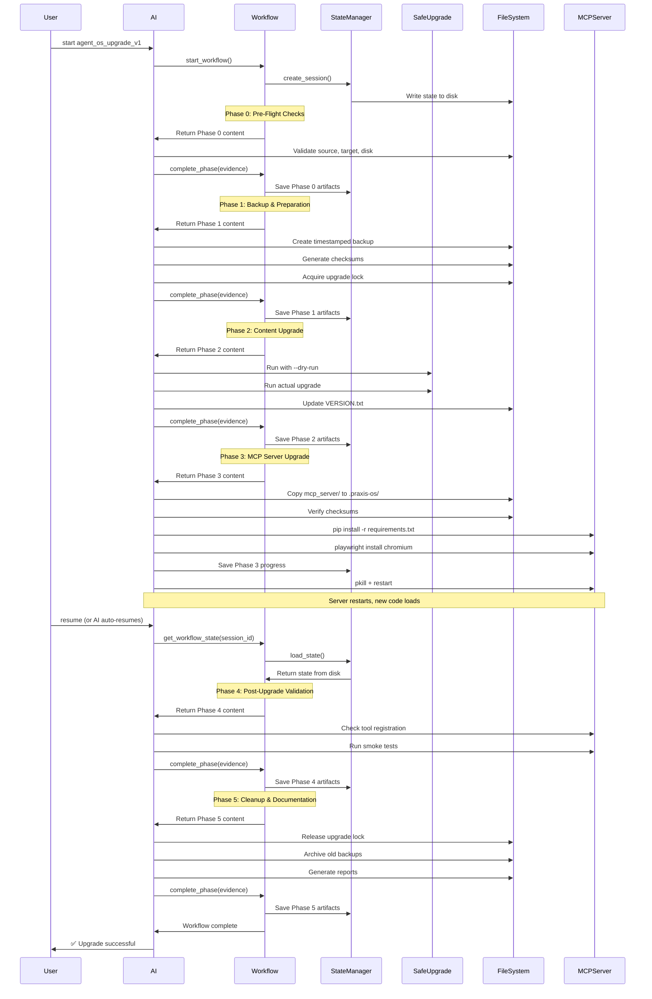
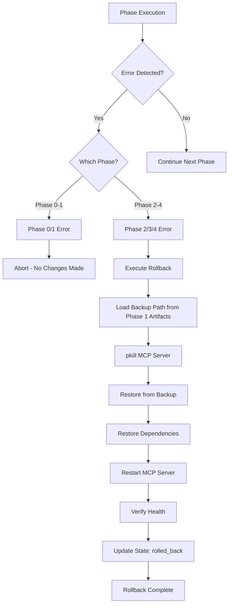

# Technical Specifications

## Agent OS Upgrade Workflow

**Version:** 1.0  
**Date:** 2025-10-08  
**Status:** Design Phase  
**Workflow ID:** `agent_os_upgrade_v1`

---

## 1. Architecture

### 1.1 System Architecture

The upgrade workflow follows the **Agent OS Meta-Framework Three-Tier Architecture** with an emphasis on **state persistence** and **resumability**.

```
┌─────────────────────────────────────────────────────────────────┐
│                     User / AI Assistant                          │
└───────────────────────────┬──────────────────────────────────────┘
                            │
                            │ MCP Tool Calls
                            ▼
┌─────────────────────────────────────────────────────────────────┐
│                      Workflow Engine                             │
│  ┌────────────────────────────────────────────────────────────┐ │
│  │ start_workflow() → create_session()                        │ │
│  │ get_current_phase() → load phase content                   │ │
│  │ complete_phase() → validate evidence → advance             │ │
│  │ get_workflow_state() → resume from disk                    │ │
│  └────────────────────────────────────────────────────────────┘ │
└───────────────────────────┬──────────────────────────────────────┘
                            │
                            │ State Operations
                            ▼
┌─────────────────────────────────────────────────────────────────┐
│                      State Manager                               │
│  ┌────────────────────────────────────────────────────────────┐ │
│  │ create_session() → write state to disk                     │ │
│  │ update_phase() → atomic write                              │ │
│  │ save_artifacts() → persist phase results                   │ │
│  │ load_state() → read from disk after restart                │ │
│  └────────────────────────────────────────────────────────────┘ │
│              ↕ Disk I/O                                          │
│  .praxis-os/.cache/state/{session-id}.json                       │
└─────────────────────────────────────────────────────────────────┘
                            │
         ┌──────────────────┼───────────────────┐
         │                  │                   │
         ▼                  ▼                   ▼
┌──────────────┐  ┌──────────────────┐  ┌────────────────┐
│ Safe Upgrade │  │  File System     │  │  MCP Server    │
│   Script     │  │  Operations      │  │   Process      │
│              │  │                  │  │                │
│ - Conflict   │  │ - Backup/restore │  │ - Install deps │
│   detection  │  │ - Copy files     │  │ - Restart      │
│ - Merge      │  │ - Checksums      │  │ - Health check │
└──────────────┘  └──────────────────┘  └────────────────┘
```

**Key Components:**

- **Workflow Engine:** Orchestrates phase execution, validates checkpoints
- **State Manager:** Persists workflow state to disk (critical for server restart)
- **Safe Upgrade Script:** Handles content upgrade with conflict detection
- **File System:** Backup, restore, copy operations with checksum validation
- **MCP Server Process:** Target of upgrade, restarted in Phase 3

**Architectural Principles:**

1. **State Persistence:** All workflow state on disk, survives process restart
2. **Validation Gates:** Each phase has explicit checkpoint criteria
3. **Rollback Safety:** Backup before any destructive operation
4. **Idempotency:** Phase operations can be retried safely
5. **Separation of Concerns:** Clear boundaries between components

---

### 1.2 Workflow Phase Flow



---

### 1.3 Rollback Flow



---

## 2. Components

### 2.1 Workflow Engine (`workflow_engine.py`)

**Responsibility:** Orchestrate workflow execution, manage phase transitions, validate checkpoints.

**Key Methods:**

```python
class WorkflowEngine:
    def start_workflow(
        self, 
        workflow_type: str, 
        target_file: str,
        options: dict
    ) -> dict:
        """
        Initialize workflow session.
        
        Args:
            workflow_type: "agent_os_upgrade_v1"
            target_file: "mcp_server"
            options: {"source_path": "/path/to/praxis-os"}
            
        Returns:
            {
                "session_id": str,
                "current_phase": 0,
                "phase_content": list,
                "workflow_overview": dict
            }
        """
        
    def get_current_phase(self, session_id: str) -> dict:
        """
        Get content for current phase.
        
        Returns phase-specific guidance from workflow/*.md files.
        """
        
    def complete_phase(
        self, 
        session_id: str,
        phase: int,
        evidence: dict
    ) -> dict:
        """
        Validate evidence and advance to next phase.
        
        Args:
            evidence: Phase-specific checkpoint evidence
            
        Returns:
            {
                "checkpoint_passed": bool,
                "phase_completed": int,
                "next_phase": int,
                "next_phase_content": dict
            }
        """
        
    def get_workflow_state(self, session_id: str) -> dict:
        """
        Resume workflow from persisted state.
        
        Critical for Phase 3 resume after server restart.
        
        Returns:
            {
                "session_id": str,
                "current_phase": int,
                "completed_phases": list,
                "phase_artifacts": dict,
                "metadata": dict
            }
        """
```

**Traceability:**
- Implements FR-8 (State Persistence)
- Implements FR-24 (Resume capability)
- Supports all phases (FR-1 through FR-30)

---

### 2.2 State Manager (`state_manager.py`)

**Responsibility:** Persist and retrieve workflow state from disk.

**Key Methods:**

```python
class StateManager:
    STATE_DIR = ".praxis-os/.cache/state/"
    
    def create_session(
        self, 
        workflow_type: str,
        target_file: str,
        metadata: dict
    ) -> str:
        """
        Create new workflow session with unique ID.
        
        Returns session_id (UUID)
        """
        
    def save_state(self, session_id: str, state: dict) -> None:
        """
        Atomically write state to disk.
        
        Uses temp file + rename for atomicity.
        Path: .praxis-os/.cache/state/{session_id}.json
        """
        
    def load_state(self, session_id: str) -> dict:
        """
        Load workflow state from disk.
        
        Critical for resume after server restart.
        
        Raises:
            StateNotFoundError: If session doesn't exist
            StateCorruptedError: If JSON invalid
        """
        
    def update_phase(
        self, 
        session_id: str,
        phase: int,
        artifacts: dict
    ) -> None:
        """
        Update current phase and save artifacts.
        
        Atomic operation to prevent corruption.
        """
        
    def list_active_sessions(self) -> list:
        """
        List all active workflow sessions.
        
        Used to detect concurrent upgrades.
        """
```

**State Schema:**

```python
{
    "session_id": "uuid-string",
    "workflow_type": "agent_os_upgrade_v1",
    "target_file": "mcp_server",
    "current_phase": 3,
    "completed_phases": [0, 1, 2],
    "phase_artifacts": {
        "0": {
            "source_path": "/path/to/praxis-os",
            "source_version": "1.2.0",
            "source_commit": "abc123def",
            "source_git_clean": true,
            "target_exists": true,
            "target_structure_valid": true,
            "disk_space_available": "2.5 GB",
            "disk_space_required": "500 MB",
            "no_concurrent_workflows": true
        },
        "1": {
            "backup_path": ".praxis-os/.backups/2025-10-08-103045/",
            "backup_timestamp": "2025-10-08T10:30:45Z",
            "files_backed_up": 487,
            "backup_size_bytes": 47483648,
            "backup_manifest": ".praxis-os/.backups/2025-10-08-103045/MANIFEST.json",
            "integrity_verified": true,
            "lock_acquired": true
        },
        "2": {
            "safe_upgrade_executed": true,
            "actual_upgrade": {
                "new_files": 3,
                "updated_files": 12,
                "conflicts_resolved": 0
            },
            "version_updated": "1.2.0"
        }
    },
    "metadata": {
        "dry_run": false,
        "auto_restart": true,
        "started_at": "2025-10-08T10:30:00Z",
        "updated_at": "2025-10-08T10:32:15Z"
    }
}
```

**Traceability:**
- Implements FR-8 (State Persistence)
- Implements FR-21, FR-22, FR-23 (State requirements)
- Enables FR-24 (Resume)
- Supports FR-25 (Artifact passing)

---

### 2.3 Safe Upgrade Script (`scripts/safe-upgrade.py`)

**Responsibility:** Upgrade content (standards, usage, workflows) with conflict detection.

**Interface:**

```python
# Command-line interface (subprocess call)
python scripts/safe-upgrade.py \
    --source /path/to/praxis-os \
    --target .praxis-os \
    [--dry-run]

# Exit codes:
# 0 = Success
# 1 = Conflicts detected (requires resolution)
# 2 = Error (invalid source/target)
```

**Output Structure:**

```json
{
    "success": true,
    "dry_run": false,
    "changes": {
        "new_files": 3,
        "updated_files": 12,
        "unchanged_files": 145,
        "conflicts": 0,
        "local_only": 2
    },
    "conflicts": [],
    "manifest_updated": true
}
```

**Traceability:**
- Implements FR-3 (Use safe-upgrade.py)
- Supports FR-12 (Dry-run mode)
- Handles conflicts (US-4)

---

### 2.4 Backup Manager (New Component)

**Responsibility:** Create, verify, restore, and manage backups.

**Key Functions:**

```python
def create_backup(backup_path: str) -> dict:
    """
    Create timestamped backup of current installation.
    
    Args:
        backup_path: Path like .praxis-os/.backups/YYYY-MM-DD-HHMMSS/
        
    Returns:
        {
            "backup_path": str,
            "files_backed_up": int,
            "backup_size_bytes": int,
            "manifest_path": str
        }
    """
    
def generate_manifest(backup_path: str) -> dict:
    """
    Generate checksums for all backed-up files.
    
    Returns manifest dict with file paths and SHA256 hashes.
    """
    
def verify_backup_integrity(backup_path: str) -> bool:
    """
    Verify backup integrity using manifest checksums.
    
    Returns True if all files match checksums.
    """
    
def restore_from_backup(backup_path: str) -> None:
    """
    Restore installation from backup.
    
    Used for rollback operation.
    """
    
def archive_old_backups(keep: int = 3) -> dict:
    """
    Archive old backups, keep only last N.
    
    Returns:
        {
            "archived_count": int,
            "kept_backups": list
        }
    """
```

**Traceability:**
- Implements FR-2 (Create backups)
- Implements FR-18 (Backup integrity)
- Implements FR-10 (Rollback support)
- Implements SR-3 (Backup before destructive ops)

---

### 2.5 Validation Module (New Component)

**Responsibility:** Validate system state at various checkpoints.

**Key Functions:**

```python
def validate_source_repo(source_path: str) -> dict:
    """
    Validate source repository.
    
    Checks:
    - Path exists
    - Is praxis-os repo
    - Git status clean
    - Extract version and commit hash
    
    Returns validation dict with results.
    """
    
def validate_target_structure(target_path: str = ".praxis-os/") -> bool:
    """
    Validate target directory structure.
    
    Checks for required directories:
    - mcp_server/
    - standards/
    - usage/
    - workflows/
    - config.json
    """
    
def check_disk_space(path: str, required_multiplier: float = 2.0) -> dict:
    """
    Check available disk space.
    
    Returns:
        {
            "available_bytes": int,
            "required_bytes": int,
            "sufficient": bool
        }
    """
    
def verify_checksums(source_dir: str, target_dir: str) -> bool:
    """
    Verify copied files match source via checksums.
    
    Used after file copy operations.
    """
    
def check_server_health() -> dict:
    """
    Check MCP server health after restart.
    
    Returns:
        {
            "responding": bool,
            "tools_registered": int,
            "expected_tools": int,
            "healthy": bool
        }
    """
```

**Traceability:**
- Implements FR-1, FR-13, FR-14, FR-15, FR-16, FR-17 (Validation)
- Implements FR-19 (Checksum verification)
- Implements FR-20 (Server health check)
- Supports SR-4, SR-5 (Safety checks)

---

### 2.6 Dependency Installer (New Component)

**Responsibility:** Install Python dependencies and handle post-install steps.

**Key Functions:**

```python
def install_dependencies(requirements_file: str) -> dict:
    """
    Install dependencies from requirements.txt.
    
    Args:
        requirements_file: Path to requirements.txt
        
    Returns:
        {
            "success": bool,
            "packages_installed": int,
            "errors": list
        }
    """
    
def detect_post_install_steps(requirements_file: str) -> list:
    """
    Scan requirements.txt for packages needing post-install.
    
    Known patterns:
    - playwright → playwright install chromium
    
    Returns list of commands to run.
    """
    
def run_post_install_steps(steps: list) -> list:
    """
    Execute post-install steps.
    
    Returns list of results:
        {
            "command": str,
            "status": "success" | "failed",
            "output": str
        }
    """
```

**Traceability:**
- Implements FR-5 (Install dependencies)
- Implements FR-6 (Post-install steps)

---

### 2.7 Server Manager (New Component)

**Responsibility:** Restart MCP server and verify health.

**Key Functions:**

```python
def restart_server() -> dict:
    """
    Restart MCP server process.
    
    Steps:
    1. pkill -f "python -m mcp_server"
    2. Wait for process to terminate
    3. Start new process in background
    4. Wait for health check
    
    Returns:
        {
            "stopped": bool,
            "started": bool,
            "restart_time": str,
            "pid": int
        }
    """
    
def wait_for_server_ready(timeout: int = 30) -> bool:
    """
    Wait for server to respond to health checks.
    
    Poll every second until server responds or timeout.
    """
```

**Traceability:**
- Implements FR-7 (Restart server)
- Implements FR-20 (Health check)

---

### 2.8 Report Generator (New Component)

**Responsibility:** Generate upgrade reports and update documentation.

**Key Functions:**

```python
def generate_upgrade_summary(
    session_id: str,
    state: dict
) -> str:
    """
    Generate human-readable upgrade summary.
    
    Returns path to generated report.
    """
    
def generate_validation_report(
    validation_results: dict
) -> str:
    """
    Generate JSON validation report.
    
    Returns path to report.
    """
    
def update_installation_summary(
    upgrade_info: dict
) -> None:
    """
    Update INSTALLATION_SUMMARY.md with upgrade details.
    """
    
def append_to_update_log(
    version: str,
    changes: dict
) -> None:
    """
    Append timestamped entry to UPDATE_LOG.txt.
    """
```

**Traceability:**
- Implements FR-11 (Upgrade report)
- Implements FR-26, FR-27, FR-28, FR-29 (Reporting)

---

## 3. Data Models

### 3.1 WorkflowSession

```python
@dataclass
class WorkflowSession:
    """Represents an active workflow session."""
    
    session_id: str  # UUID
    workflow_type: str  # "agent_os_upgrade_v1"
    target_file: str  # "mcp_server"
    current_phase: int  # 0-5
    completed_phases: list[int]
    phase_artifacts: dict[int, dict]
    metadata: dict
    started_at: datetime
    updated_at: datetime
    
    def to_dict(self) -> dict:
        """Serialize for JSON storage."""
        
    @classmethod
    def from_dict(cls, data: dict) -> 'WorkflowSession':
        """Deserialize from JSON."""
```

---

### 3.2 Phase Evidence Models

```python
@dataclass
class Phase0Evidence:
    """Evidence required to pass Phase 0 checkpoint."""
    
    source_path: str
    source_version: str
    source_commit: str
    source_git_clean: bool
    target_exists: bool
    target_structure_valid: bool
    disk_space_available: str
    disk_space_required: str
    no_concurrent_workflows: bool

@dataclass
class Phase1Evidence:
    """Evidence required to pass Phase 1 checkpoint."""
    
    backup_path: str
    backup_timestamp: str
    files_backed_up: int
    backup_size_bytes: int
    backup_manifest: str
    integrity_verified: bool
    lock_acquired: bool

@dataclass
class Phase2Evidence:
    """Evidence required to pass Phase 2 checkpoint."""
    
    safe_upgrade_executed: bool
    dry_run_preview: dict
    actual_upgrade: dict
    version_updated: str
    update_log_appended: bool

@dataclass
class Phase3Evidence:
    """Evidence required to pass Phase 3 checkpoint."""
    
    mcp_server_copied: bool
    files_copied: int
    checksums_verified: bool
    dependencies_installed: bool
    post_install_steps: list
    server_restarted: bool
    server_restart_time: str
    server_health_check: str  # "passed" | "failed"

@dataclass
class Phase4Evidence:
    """Evidence required to pass Phase 4 checkpoint."""
    
    server_version: str
    tools_registered: int
    expected_tools: int
    browser_tools_enabled: bool
    browser_smoke_test: str
    rag_search_test: str
    workflow_engine_test: str
    file_watchers_active: bool
    rag_index_current: bool
    unit_tests_passed: bool
    validation_report: str

@dataclass
class Phase5Evidence:
    """Evidence required to pass Phase 5 checkpoint."""
    
    lock_released: bool
    old_backups_archived: int
    upgrade_summary: str
    installation_summary_updated: bool
    update_log_appended: bool
    git_changes_committed: bool
```

---

### 3.3 BackupManifest

```python
@dataclass
class BackupManifest:
    """Manifest of backed-up files with checksums."""
    
    backup_path: str
    timestamp: datetime
    files: dict[str, str]  # path -> SHA256 hash
    total_size_bytes: int
    
    def to_json(self) -> str:
        """Serialize to JSON for MANIFEST.json file."""
        
    @classmethod
    def from_json(cls, json_str: str) -> 'BackupManifest':
        """Deserialize from JSON."""
```

---

### 3.4 UpgradeReport

```python
@dataclass
class UpgradeReport:
    """Summary of upgrade operation."""
    
    session_id: str
    workflow_type: str
    started_at: datetime
    completed_at: datetime
    duration_seconds: float
    from_version: str
    to_version: str
    phases_completed: list[int]
    phase_summaries: dict[int, str]
    issues_encountered: list[str]
    rollback_performed: bool
    success: bool
    
    def to_markdown(self) -> str:
        """Generate human-readable markdown report."""
```

---

## 4. APIs & Interfaces

### 4.1 MCP Tool Interface

The workflow is invoked via MCP tools:

```python
# Start workflow
start_workflow(
    workflow_type="agent_os_upgrade_v1",
    target_file="mcp_server",
    options={
        "source_path": "/path/to/praxis-os",
        "dry_run": false,
        "auto_restart": true
    }
)
# Returns: {session_id, phase_content, workflow_overview}

# Get current phase
get_current_phase(session_id=session_id)
# Returns: {current_phase, phase_content}

# Complete phase
complete_phase(
    session_id=session_id,
    phase=0,
    evidence={...}  # Phase-specific evidence dict
)
# Returns: {checkpoint_passed, next_phase, next_phase_content}

# Resume after restart
get_workflow_state(session_id=session_id)
# Returns: {current_phase, completed_phases, phase_artifacts, ...}
```

---

### 4.2 File System Interface

**Backup Directory Structure:**

```
.praxis-os/.backups/YYYY-MM-DD-HHMMSS/
├── MANIFEST.json           # Checksum manifest
├── mcp_server/             # Server code backup
│   ├── __init__.py
│   ├── workflow_engine.py
│   └── ...
├── config.json             # Config backup
├── standards/              # Standards backup
├── usage/                  # Usage backup
├── workflows/              # Workflows backup
└── requirements-snapshot.txt  # Installed packages
```

**State Directory Structure:**

```
.praxis-os/.cache/state/
├── {session-id-1}.json
├── {session-id-2}.json
└── ...
```

**Lock File:**

```
.praxis-os/.upgrade-lock
{
    "session_id": "uuid",
    "started_at": "2025-10-08T10:30:00Z",
    "pid": 12345
}
```

---

### 4.3 Subprocess Interface

**Safe Upgrade Script:**

```bash
python scripts/safe-upgrade.py \
    --source /path/to/praxis-os \
    --target .praxis-os \
    [--dry-run]
```

**Dependency Installation:**

```bash
pip install -r .praxis-os/mcp_server/requirements.txt
```

**Post-Install Steps:**

```bash
playwright install chromium
```

**Server Restart:**

```bash
pkill -f "python -m mcp_server"
python -m mcp_server &
```

---

## 5. Security

### 5.1 Security Controls

| Control | Implementation | Requirement |
|---------|----------------|-------------|
| **Input Validation** | Validate source path is legitimate repo | SR-5 |
| **Git Status Check** | Require clean git state (no uncommitted changes) | SR-5 |
| **Checksum Validation** | SHA256 checksums for all file operations | SR-4 |
| **Backup Protection** | Never delete user content, always backup first | SR-1, SR-3 |
| **Config Preservation** | Prompt before overwriting config.json | SR-2 |
| **Lock File** | Prevent concurrent upgrades (race conditions) | SR-6 |
| **Atomic State Writes** | Use temp file + rename to prevent corruption | NFR-R3 |
| **Path Sanitization** | Validate all file paths stay within .praxis-os/ | Security |

---

### 5.2 Threat Model

| Threat | Mitigation |
|--------|------------|
| **Malicious Source Repo** | Validate git status clean, checksum verification |
| **Disk Full During Upgrade** | Pre-flight disk space check (2x required) |
| **Concurrent Upgrade Corruption** | Lock file prevents concurrent access |
| **State Corruption During Crash** | Atomic writes, can rollback to last checkpoint |
| **User Data Loss** | Never delete, always backup, preserve config |
| **Dependency Supply Chain Attack** | User controls source repo, checksums verified |

---

## 6. Performance

### 6.1 Performance Targets

| Operation | Target | Strategy |
|-----------|--------|----------|
| **Phase 0: Pre-Flight** | < 30s | Parallel checks where possible |
| **Phase 1: Backup** | < 20s | Incremental backup (future optimization) |
| **Phase 2: Content Upgrade** | < 45s | Leverage existing safe-upgrade.py |
| **Phase 3: MCP Upgrade** | < 60s | Parallel download during backup (future) |
| **Phase 4: Validation** | < 30s | Skip full test suite by default |
| **Phase 5: Cleanup** | < 15s | Archive async (future optimization) |
| **Total Upgrade** | < 2 min | Target for typical case (NFR-P1) |
| **Rollback** | < 30s | Optimized restore path (NFR-P3) |

---

### 6.2 Performance Optimizations

**Implemented (v1.0):**
- Pre-flight checks prevent wasted work
- Checksum caching for repeated validations
- Atomic state writes (no lock contention)
- Single-pass file operations

**Future (v1.1+):**
- Parallel downloads during backup
- Delta upgrades (only changed files)
- Incremental backups
- Async backup archival

---

### 6.3 Resource Usage

| Resource | Typical | Peak | Notes |
|----------|---------|------|-------|
| **Disk Space** | +500 MB | +1.5 GB | Temporary backup + new files |
| **Memory** | < 100 MB | < 200 MB | File buffers, state management |
| **CPU** | Low | Medium | Checksum calculation, file copy |
| **Network** | 100-300 MB | 500 MB | Dependencies + Playwright browsers |

---

## 7. Error Handling

### 7.1 Error Handling Strategy

**Principles:**
1. **Fail fast:** Detect problems in pre-flight (Phase 0)
2. **Rollback on failure:** Phases 2-4 trigger automatic rollback
3. **Preserve state:** Always save progress before risky operations
4. **Clear messaging:** Actionable error messages for users

---

### 7.2 Error Scenarios & Handling

| Scenario | Detection | Handling | User Action |
|----------|-----------|----------|-------------|
| **Source repo dirty** | Phase 0 git check | ❌ Abort with message | Commit or stash changes |
| **Insufficient disk space** | Phase 0 disk check | ❌ Abort with message | Free up space |
| **Backup creation fails** | Phase 1 verify | ❌ Abort (unsafe to proceed) | Check permissions |
| **Backup integrity fails** | Phase 1 checksums | ❌ Abort (unsafe to proceed) | Retry, check disk |
| **Content conflicts** | Phase 2 safe-upgrade | ⚠️ Prompt for resolution | Choose: local/remote/merge |
| **Dependency install fails** | Phase 3 pip | 🔄 Auto-rollback | Check network, retry |
| **Server won't restart** | Phase 3 health check | 🔄 Auto-rollback | Check logs, manual restart |
| **Validation fails** | Phase 4 tests | 🔄 Auto-rollback | Report issue, manual fix |
| **Lock file exists** | Phase 0 lock check | ❌ Abort | Wait for other upgrade |
| **State corrupted** | Resume | 🔄 Rollback to last checkpoint | Report bug |

---

### 7.3 Rollback Procedure

**Trigger Conditions:**
- Phase 2, 3, or 4 failure
- Manual user request
- AI detects critical issue

**Procedure:**

```python
def rollback_upgrade(session_id: str, reason: str) -> dict:
    """
    Rollback upgrade to backup state.
    
    Steps:
    1. Load state to get backup_path
    2. Stop MCP server (pkill)
    3. Restore files from backup
    4. Restore dependencies
    5. Restart server
    6. Verify health
    7. Update state: status="rolled_back"
    
    Returns:
        {
            "success": bool,
            "rollback_time_seconds": float,
            "server_healthy": bool
        }
    """
```

**Target Time:** < 30 seconds (NFR-P3)

---

## 8. Testing Strategy

### 8.1 Unit Tests

**Test Coverage:**

| Component | Tests | Coverage Target |
|-----------|-------|-----------------|
| StateManager | 15 tests | > 90% |
| BackupManager | 12 tests | > 90% |
| ValidationModule | 18 tests | > 85% |
| DependencyInstaller | 8 tests | > 80% |
| WorkflowEngine | 20 tests | > 85% |

**Key Test Cases:**
- State persistence and recovery
- Atomic state writes
- Backup creation and verification
- Checksum validation
- Rollback procedure
- Checkpoint validation

---

### 8.2 Integration Tests

**Scenarios:**

1. **Happy Path:** Full upgrade, no conflicts
2. **Content Conflicts:** Conflicts during Phase 2
3. **Dependency Failure:** pip install fails in Phase 3
4. **Server Restart Failure:** Health check fails in Phase 3
5. **Validation Failure:** Smoke tests fail in Phase 4
6. **Resume After Restart:** Server restarts mid-Phase 3
7. **Rollback:** Various failure scenarios
8. **Concurrent Upgrade Prevention:** Lock file handling
9. **Insufficient Disk Space:** Pre-flight check catches

---

### 8.3 Dogfooding Tests

**Test Environments:**

1. **Agent OS Enhanced (Self):** Upgrade itself
2. **Python SDK Project:** Real-world customer scenario
3. **Clean Installation:** Fresh .praxis-os/ setup
4. **Modified Installation:** Custom files present

**Success Criteria:**
- All workflows pass
- No data loss
- Rollback works
- User feedback positive

---

## 9. Deployment

### 9.1 Workflow Installation

**Location:**

```
universal/workflows/agent_os_upgrade_v1/
├── metadata.json
├── phases/
│   ├── 0-pre-flight-checks.md
│   ├── 1-backup-preparation.md
│   ├── 2-content-upgrade.md
│   ├── 3-mcp-server-upgrade.md
│   ├── 4-post-upgrade-validation.md
│   └── 5-cleanup-documentation.md
└── supporting-docs/
    ├── rollback-procedure.md
    ├── troubleshooting.md
    └── validation-criteria.md
```

**Metadata (metadata.json):**

```json
{
  "name": "agent_os_upgrade_v1",
  "version": "1.0.0",
  "description": "AI-guided Agent OS upgrade with validation and rollback",
  "phases": [
    {
      "number": 0,
      "name": "Pre-Flight Checks",
      "file": "0-pre-flight-checks.md",
      "estimated_time": "30s"
    },
    {
      "number": 1,
      "name": "Backup & Preparation",
      "file": "1-backup-preparation.md",
      "estimated_time": "20s"
    },
    {
      "number": 2,
      "name": "Content Upgrade",
      "file": "2-content-upgrade.md",
      "estimated_time": "45s"
    },
    {
      "number": 3,
      "name": "MCP Server Upgrade",
      "file": "3-mcp-server-upgrade.md",
      "estimated_time": "60s",
      "requires_restart": true
    },
    {
      "number": 4,
      "name": "Post-Upgrade Validation",
      "file": "4-post-upgrade-validation.md",
      "estimated_time": "30s"
    },
    {
      "number": 5,
      "name": "Cleanup & Documentation",
      "file": "5-cleanup-documentation.md",
      "estimated_time": "15s"
    }
  ],
  "total_estimated_time": "3m 20s",
  "supports_dry_run": true,
  "supports_rollback": true,
  "requires_user_interaction": "optional"
}
```

---

### 9.2 Component Deployment

**New Files:**

```
mcp_server/
├── backup_manager.py         (NEW)
├── validation_module.py      (NEW)
├── dependency_installer.py   (NEW)
├── server_manager.py         (NEW)
├── report_generator.py       (NEW)
└── models/
    └── upgrade_models.py     (NEW)
```

**Modified Files:**

```
mcp_server/
├── workflow_engine.py        (MODIFIED - add resume support)
├── state_manager.py          (MODIFIED - enhance state persistence)
└── server/
    └── factory.py            (MODIFIED - register workflow)
```

---

## 10. Monitoring & Observability

### 10.1 Metrics

**Key Metrics to Track:**

| Metric | Type | Purpose |
|--------|------|---------|
| `upgrade_started` | Counter | Number of upgrade attempts |
| `upgrade_completed` | Counter | Successful upgrades |
| `upgrade_failed` | Counter | Failed upgrades |
| `upgrade_rolled_back` | Counter | Rollback executions |
| `upgrade_duration_seconds` | Histogram | Time distribution |
| `phase_duration_seconds` | Histogram | Per-phase timing |
| `rollback_duration_seconds` | Histogram | Rollback timing |
| `server_restart_duration_seconds` | Histogram | Restart timing |

---

### 10.2 Logging

**Log Levels:**

- **DEBUG:** State transitions, checkpoint validation
- **INFO:** Phase start/completion, major operations
- **WARNING:** Non-fatal issues, conflicts detected
- **ERROR:** Failures requiring rollback
- **CRITICAL:** Data loss risks, corruption detected

**Key Log Points:**

```python
logger.info(f"Workflow started: {session_id}")
logger.info(f"Phase {phase} started")
logger.debug(f"Evidence validation: {evidence}")
logger.info(f"Phase {phase} completed")
logger.warning(f"Conflicts detected: {conflicts}")
logger.error(f"Phase {phase} failed: {error}")
logger.info(f"Rollback initiated: {reason}")
logger.info(f"Rollback completed: {duration}s")
logger.info(f"Workflow completed: {session_id}")
```

---

## 11. Future Enhancements

### 11.1 Version 1.1 (Next Release)

- **Delta Upgrades:** Only copy changed files
- **Custom Modification Detection:** Three-way merge for user changes
- **Parallel Downloads:** Download browsers during backup
- **Optional Git Commit:** Make configurable

---

### 11.2 Version 2.0 (Future)

- **Auto-Update Schedule:** Cron job for automatic upgrades
- **Canary Deployments:** Test on subset first
- **Multi-Project Batch Upgrades:** Upgrade all projects at once
- **Cloud Backup:** Disaster recovery

---

## 12. References

### 12.1 Requirements Traceability

All requirements from `srd.md` are traceable to specific components and implementations in this document.

**Key Mappings:**
- FR-1 through FR-30 → Validation Module, Phase implementations
- SR-1 through SR-6 → Backup Manager, Security controls
- NFR-P1 through NFR-P5 → Performance targets
- NFR-R1 through NFR-R5 → Testing strategy
- NFR-U1 through NFR-U5 → API design
- NFR-M1 through NFR-M5 → Architecture adherence
- NFR-S1 through NFR-S5 → Security controls

---

### 12.2 Related Documents

- [srd.md](srd.md) - Requirements (WHAT to build)
- [tasks.md](tasks.md) - Implementation tasks (HOW to build, step-by-step)
- [supporting-docs/agent-os-upgrade-workflow-design.md](supporting-docs/agent-os-upgrade-workflow-design.md) - Original design
- [supporting-docs/INSIGHTS.md](supporting-docs/INSIGHTS.md) - Extracted insights

---

## 13. Approval & Sign-Off

| Role | Name | Date | Status |
|------|------|------|--------|
| Technical Author | AI Assistant | 2025-10-08 | ✅ Complete |
| Reviewer | TBD | TBD | ⏳ Pending |
| Approver | Josh (Human) | TBD | ⏳ Pending |

---

## Changelog

| Version | Date | Changes | Author |
|---------|------|---------|--------|
| 1.0 | 2025-10-08 | Initial technical specifications | AI Assistant |

---

**Status:** ✅ Design Complete  
**Next Phase:** Phase 3 - Task Breakdown (tasks.md)

---

_This document defines **HOW** the system will be built. See `tasks.md` for step-by-step implementation tasks._

