# Agent OS Upgrade Workflow - Design Document

**Version:** 1.0  
**Date:** 2025-10-08  
**Status:** Design Phase  
**Workflow ID:** `agent_os_upgrade_v1`

---

## Executive Summary

An AI-guided workflow for safely upgrading Agent OS installations (content + MCP server) with automatic validation, rollback capability, and persistence across server restarts. Demonstrates meta-workflow principles for complex operational tasks.

**Key Innovation:** Workflow state persists to disk (`.praxis-os/.cache/state/`), enabling the workflow to survive MCP server restarts during the upgrade process.

---

## 1. Problem Statement

### Current Pain Points

1. **Manual process prone to errors:**
   - Forget to copy files to `.praxis-os/`
   - Miss post-install steps (e.g., `playwright install`)
   - No validation that upgrade succeeded
   - Hard to rollback if something breaks

2. **Insufficient documentation:**
   - Update guides are text-based, easy to skip steps
   - No programmatic validation
   - AI has to interpret docs, prone to mistakes

3. **Dogfooding complexity:**
   - Copy-based installation requires manual sync
   - Multiple components to update (content, MCP server, dependencies)
   - No single source of truth for upgrade process

### What Success Looks Like

```bash
# User runs one command
pos_workflow start agent_os_upgrade_v1 --source /path/to/praxis-os

# AI handles:
✅ Pre-upgrade validation (git status, backups exist, etc.)
✅ Content upgrade via safe-upgrade.py (conflict detection)
✅ MCP server code sync
✅ Dependency installation (including post-install steps)
✅ Server restart
✅ Post-upgrade validation (tests, tools work)
✅ Cleanup and documentation

# If anything fails: automatic rollback to backup
```

---

## 2. Requirements

### Functional Requirements (FR)

| ID | Requirement | Priority | Rationale |
|----|-------------|----------|-----------|
| FR-1 | Validate source repo before upgrade | MUST | Prevent upgrading from dirty/invalid source |
| FR-2 | Create timestamped backups | MUST | Enable rollback if upgrade fails |
| FR-3 | Use safe-upgrade.py for content | MUST | Leverage existing conflict detection |
| FR-4 | Sync MCP server code to .praxis-os/ | MUST | Core upgrade requirement |
| FR-5 | Install dependencies from requirements.txt | MUST | Keep dependencies in sync |
| FR-6 | Handle post-install steps (playwright, etc.) | MUST | Many packages need post-install |
| FR-7 | Restart MCP server gracefully | MUST | Load new code |
| FR-8 | Persist workflow state across restart | MUST | Resume after server restart |
| FR-9 | Validate upgrade succeeded | MUST | Catch failures early |
| FR-10 | Rollback on failure | SHOULD | Minimize downtime |
| FR-11 | Generate upgrade report | SHOULD | Document what changed |
| FR-12 | Support dry-run mode | SHOULD | Preview changes before applying |

### Safety Requirements (SR)

| ID | Requirement | Rationale |
|----|-------------|-----------|
| SR-1 | Never delete user content | Preserve customizations |
| SR-2 | Never overwrite config without prompt | Preserve user settings |
| SR-3 | Create backup before any destructive operation | Enable rollback |
| SR-4 | Validate checksums after copy | Detect corruption |
| SR-5 | Require clean git state in source | Prevent partial upgrades |
| SR-6 | Lock workflow to prevent concurrent upgrades | Avoid race conditions |

### Non-Functional Requirements (NFR)

| ID | Requirement | Target | Measurement |
|----|-------------|--------|-------------|
| NFR-1 | Upgrade time (typical) | < 2 minutes | Timer |
| NFR-2 | Upgrade time (with conflicts) | < 5 minutes | Timer |
| NFR-3 | Rollback time | < 30 seconds | Timer |
| NFR-4 | Success rate (no conflicts) | > 95% | Telemetry |
| NFR-5 | Documentation quality | 100% phase coverage | Review |

---

## 3. Architecture

### 3.1 Workflow Structure

```
universal/workflows/agent_os_upgrade_v1/
├── metadata.json              # Workflow metadata (phases, dependencies)
├── srd.md                     # System Requirements Document (this doc)
├── phases/
│   ├── 0-pre-flight-checks.md
│   ├── 1-backup-preparation.md
│   ├── 2-content-upgrade.md
│   ├── 3-mcp-server-upgrade.md
│   ├── 4-post-upgrade-validation.md
│   └── 5-cleanup-documentation.md
└── supporting-docs/
    ├── rollback-procedure.md
    ├── troubleshooting.md
    └── validation-criteria.md
```

### 3.2 State Persistence

**Critical Design Decision:** State persists across MCP server restart.

```json
.praxis-os/.cache/state/{session-id}.json
{
  "session_id": "uuid",
  "workflow_type": "agent_os_upgrade_v1",
  "target_file": "mcp_server",
  "current_phase": 3,
  "completed_phases": [0, 1, 2],
  "phase_artifacts": {
    "0": {
      "source_path": "/path/to/praxis-os",
      "source_version": "1.2.0",
      "source_commit": "abc123",
      "validation_passed": true
    },
    "1": {
      "backup_path": ".praxis-os/.backups/2025-10-08-103045/",
      "backup_size": "45.2 MB",
      "files_backed_up": 487
    },
    "2": {
      "content_upgrade_report": {
        "new_files": 3,
        "updated_files": 12,
        "conflicts": 0,
        "skipped_files": 2
      }
    }
  },
  "metadata": {
    "dry_run": false,
    "auto_restart": true
  }
}
```

### 3.3 Component Interactions

```mermaid
sequenceDiagram
    participant User
    participant AI
    participant Workflow
    participant StateManager
    participant SafeUpgrade
    participant MCPServer

    User->>AI: start workflow agent_os_upgrade_v1
    AI->>Workflow: start_workflow()
    Workflow->>StateManager: create_session()
    StateManager->>StateManager: Save to disk
    
    loop Each Phase 0-2
        Workflow->>AI: Return phase content
        AI->>AI: Execute phase tasks
        AI->>Workflow: complete_phase(evidence)
        Workflow->>StateManager: Save artifacts to disk
    end
    
    Note over AI,MCPServer: Phase 3: MCP Server Upgrade
    AI->>SafeUpgrade: Copy mcp_server/ to .praxis-os/
    AI->>AI: pip install -r requirements.txt
    AI->>AI: playwright install chromium
    AI->>MCPServer: Restart (pkill + start)
    
    Note over StateManager,MCPServer: Server restarts, new code loads
    
    User->>AI: continue upgrade (session_id)
    AI->>Workflow: get_workflow_state(session_id)
    Workflow->>StateManager: load_state(session_id)
    StateManager->>Workflow: Return state from disk
    
    loop Remaining Phases 4-5
        Workflow->>AI: Return phase content
        AI->>AI: Execute validation
        AI->>Workflow: complete_phase(evidence)
    end
    
    AI->>User: ✅ Upgrade complete
```



---

## 4. Phase Design

### Phase 0: Pre-Flight Checks

**Purpose:** Validate source and target before any modifications.

**Tasks:**
1. Validate source path exists and is praxis-os repo
2. Check source repo git status (clean, no uncommitted changes)
3. Extract source version and commit hash
4. Validate target .praxis-os/ directory structure
5. Check for existing backups (warn if > 7 days old)
6. Verify disk space (need 2x current .praxis-os size)
7. Check for running workflows (prevent concurrent upgrades)

**Checkpoint Evidence:**
```json
{
  "source_path": "/path/to/praxis-os",
  "source_version": "1.2.0",
  "source_commit": "abc123def",
  "source_git_clean": true,
  "target_exists": true,
  "target_structure_valid": true,
  "disk_space_available": "2.5 GB",
  "disk_space_required": "500 MB",
  "no_concurrent_workflows": true
}
```

**Exit Criteria:**
- ✅ Source repo is valid praxis-os
- ✅ Source git status is clean
- ✅ Target .praxis-os/ structure is valid
- ✅ Sufficient disk space
- ✅ No other upgrade workflows running

---

### Phase 1: Backup & Preparation

**Purpose:** Create safety net for rollback.

**Tasks:**
1. Create timestamped backup directory
2. Backup .praxis-os/config.json
3. Backup .praxis-os/mcp_server/ (current code)
4. Backup any custom files (detected by manifest)
5. Generate backup manifest (checksums)
6. Test backup integrity
7. Lock upgrade process (create .praxis-os/.upgrade-lock)

**Checkpoint Evidence:**
```json
{
  "backup_path": ".praxis-os/.backups/2025-10-08-103045/",
  "backup_timestamp": "2025-10-08T10:30:45Z",
  "files_backed_up": 487,
  "backup_size_bytes": 47483648,
  "backup_manifest": ".praxis-os/.backups/2025-10-08-103045/MANIFEST.json",
  "integrity_verified": true,
  "lock_acquired": true
}
```

**Exit Criteria:**
- ✅ Backup created with timestamp
- ✅ All critical files backed up
- ✅ Backup manifest generated
- ✅ Backup integrity verified
- ✅ Upgrade lock acquired

---

### Phase 2: Content Upgrade

**Purpose:** Update universal/ content (standards, usage, workflows) using safe-upgrade.py.

**Tasks:**
1. Run safe-upgrade.py --source {source} --target .praxis-os --dry-run
2. Display preview to user (what will change)
3. Run safe-upgrade.py without dry-run
4. Handle conflicts interactively (prompt AI for decisions)
5. Verify content checksums match manifest
6. Update VERSION.txt and UPDATE_LOG.txt

**Checkpoint Evidence:**
```json
{
  "safe_upgrade_executed": true,
  "dry_run_preview": {
    "new_files": 3,
    "updated_files": 12,
    "unchanged_files": 145,
    "conflicts": 0,
    "local_only": 2
  },
  "actual_upgrade": {
    "new_files": 3,
    "updated_files": 12,
    "conflicts_resolved": 0,
    "user_prompts": 0
  },
  "version_updated": "1.2.0",
  "update_log_appended": true
}
```

**Exit Criteria:**
- ✅ safe-upgrade.py executed successfully
- ✅ All conflicts resolved
- ✅ VERSION.txt updated
- ✅ UPDATE_LOG.txt appended

---

### Phase 3: MCP Server Upgrade

**Purpose:** Update MCP server code and dependencies, then restart.

**⚠️ CRITICAL PHASE:** Server will restart, workflow must resume from state.

**Tasks:**
1. Copy mcp_server/ to .praxis-os/mcp_server/ (preserve __pycache__)
2. Verify copied files match source (checksums)
3. Install dependencies: `pip install -r .praxis-os/mcp_server/requirements.txt`
4. Detect post-install requirements (scan for playwright, etc.)
5. Run post-install steps (playwright install chromium)
6. **Restart MCP server** (pkill + start in background)
7. Wait for server to respond (health check)

**Checkpoint Evidence:**
```json
{
  "mcp_server_copied": true,
  "files_copied": 42,
  "checksums_verified": true,
  "dependencies_installed": true,
  "post_install_steps": [
    {
      "command": "playwright install chromium",
      "status": "success",
      "size_downloaded": "129.7 MB"
    }
  ],
  "server_restarted": true,
  "server_restart_time": "2025-10-08T10:32:15Z",
  "server_health_check": "passed"
}
```

**Exit Criteria:**
- ✅ mcp_server/ copied and verified
- ✅ Dependencies installed
- ✅ Post-install steps completed
- ✅ Server restarted
- ✅ Server responds to health check

**Resume Logic:**
After restart, AI queries `get_workflow_state(session_id)` → reads state from disk → continues to Phase 4.

---

### Phase 4: Post-Upgrade Validation

**Purpose:** Verify upgrade succeeded and everything works.

**Tasks:**
1. Query MCP server tools list (verify pos_browser, etc. loaded)
2. Run smoke tests (RAG search, workflow list)
3. Validate browser tools (if enabled): start session, navigate, close
4. Check file watcher status
5. Verify RAG index is current
6. Run unit tests (optional, slow)
7. Generate validation report

**Checkpoint Evidence:**
```json
{
  "server_version": "1.2.0",
  "tools_registered": 8,
  "expected_tools": 8,
  "browser_tools_enabled": true,
  "browser_smoke_test": "passed",
  "rag_search_test": "passed",
  "workflow_engine_test": "passed",
  "file_watchers_active": true,
  "rag_index_current": true,
  "unit_tests_passed": true,
  "validation_report": ".praxis-os/.cache/upgrade-validation-2025-10-08.json"
}
```

**Exit Criteria:**
- ✅ All expected tools registered
- ✅ Smoke tests passed
- ✅ No errors in server log
- ✅ Validation report generated

---

### Phase 5: Cleanup & Documentation

**Purpose:** Clean up temporary files and document the upgrade.

**Tasks:**
1. Remove upgrade lock (.praxis-os/.upgrade-lock)
2. Archive old backups (keep last 3, delete rest)
3. Generate upgrade summary report
4. Update .praxis-os/INSTALLATION_SUMMARY.md with upgrade details
5. Append to .praxis-os/UPDATE_LOG.txt
6. (Optional) Commit changes to customer repo if git-tracked

**Checkpoint Evidence:**
```json
{
  "lock_released": true,
  "old_backups_archived": 2,
  "upgrade_summary": ".praxis-os/.cache/upgrade-summary-2025-10-08.md",
  "installation_summary_updated": true,
  "update_log_appended": true,
  "git_changes_committed": false
}
```

**Exit Criteria:**
- ✅ Lock released
- ✅ Cleanup complete
- ✅ Documentation updated
- ✅ Upgrade summary generated

---

## 5. Rollback Strategy

### When to Rollback

**Automatic rollback triggers:**
- Phase 2 fails (safe-upgrade.py errors)
- Phase 3 fails (dependency install fails)
- Phase 4 fails (validation fails)

**Manual rollback:**
- User requests rollback
- AI detects critical issues

### Rollback Procedure

```bash
# From backup artifacts in state
backup_path = phase_artifacts["1"]["backup_path"]

# 1. Stop MCP server
pkill -f "python -m mcp_server"

# 2. Restore from backup
cp -r {backup_path}/mcp_server .praxis-os/
cp {backup_path}/config.json .praxis-os/
cp -r {backup_path}/standards .praxis-os/
cp -r {backup_path}/usage .praxis-os/
cp -r {backup_path}/workflows .praxis-os/

# 3. Restore dependencies (from backup manifest)
pip install -r {backup_path}/requirements-snapshot.txt

# 4. Restart server
python -m mcp_server &

# 5. Verify rollback
# ... health checks ...

# 6. Update state
workflow.update_state(status="rolled_back", reason="...")
```

**Rollback Time:** Target < 30 seconds

---

## 6. Configuration

### Workflow Metadata

```json
{
  "name": "agent_os_upgrade_v1",
  "version": "1.0.0",
  "description": "AI-guided Agent OS upgrade with validation and rollback",
  "phases": [
    {
      "number": 0,
      "name": "Pre-Flight Checks",
      "file": "0-pre-flight-checks.md",
      "estimated_time": "30s"
    },
    {
      "number": 1,
      "name": "Backup & Preparation",
      "file": "1-backup-preparation.md",
      "estimated_time": "20s"
    },
    {
      "number": 2,
      "name": "Content Upgrade",
      "file": "2-content-upgrade.md",
      "estimated_time": "45s"
    },
    {
      "number": 3,
      "name": "MCP Server Upgrade",
      "file": "3-mcp-server-upgrade.md",
      "estimated_time": "60s",
      "requires_restart": true
    },
    {
      "number": 4,
      "name": "Post-Upgrade Validation",
      "file": "4-post-upgrade-validation.md",
      "estimated_time": "30s"
    },
    {
      "number": 5,
      "name": "Cleanup & Documentation",
      "file": "5-cleanup-documentation.md",
      "estimated_time": "15s"
    }
  ],
  "total_estimated_time": "3m 20s",
  "supports_dry_run": true,
  "supports_rollback": true,
  "requires_user_interaction": "optional"
}
```

### User Configuration Options

```json
{
  "source_path": "/path/to/praxis-os",
  "dry_run": false,
  "auto_restart": true,
  "skip_tests": false,
  "keep_backups": 3,
  "interactive_conflicts": true,
  "git_commit_after": false
}
```

---

## 7. Edge Cases & Error Handling

| Scenario | Detection | Handling |
|----------|-----------|----------|
| Source repo has uncommitted changes | Phase 0 git status check | ❌ Abort, prompt user to commit/stash |
| Insufficient disk space | Phase 0 disk check | ❌ Abort, prompt user to free space |
| Backup fails | Phase 1 backup verify | ❌ Abort, cannot proceed without backup |
| Content conflicts | Phase 2 safe-upgrade.py | ⚠️ Prompt AI for resolution |
| Dependency install fails | Phase 3 pip install | 🔄 Rollback to backup |
| Server won't restart | Phase 3 health check | 🔄 Rollback to backup |
| Validation fails | Phase 4 smoke tests | 🔄 Rollback to backup |
| Another upgrade in progress | Phase 0 lock check | ❌ Abort, wait for completion |
| State file corrupted | Any phase resume | 🔄 Rollback to last checkpoint |

---

## 8. Success Metrics

### Key Performance Indicators (KPIs)

| Metric | Target | Current | Measurement |
|--------|--------|---------|-------------|
| Upgrade success rate | > 95% | TBD | Telemetry |
| Average upgrade time | < 2 min | TBD | Timer |
| Rollback success rate | 100% | TBD | Telemetry |
| User satisfaction | > 4.5/5 | TBD | Survey |
| Documentation coverage | 100% | TBD | Review |

### Validation Criteria

**Upgrade is successful if:**
1. ✅ All phases completed without errors
2. ✅ MCP server responds to requests
3. ✅ All expected tools registered
4. ✅ Smoke tests pass
5. ✅ No errors in server log
6. ✅ Version updated correctly

---

## 9. Testing Strategy

### Unit Tests
- Test each phase independently with mocked dependencies
- Test state persistence and recovery
- Test rollback procedure
- Test checkpoint validation

### Integration Tests
- Test full workflow end-to-end in test environment
- Test with conflicts (simulated)
- Test with insufficient disk space
- Test server restart and resume
- Test rollback scenarios

### Dogfooding Tests
- Run on praxis-os itself
- Run on python-sdk project
- Run on customer projects (with permission)

---

## 10. Future Enhancements

### Phase 2 (v1.1)
- **Parallel downloads:** Download playwright browsers during backup
- **Delta upgrades:** Only copy changed files
- **Upgrade history:** Track all upgrades in database
- **Telemetry:** Send anonymous metrics to improve workflow

### Phase 3 (v2.0)
- **Auto-update schedule:** Cron job for automatic upgrades
- **Canary deployments:** Test on subset of workflows first
- **Multi-project upgrades:** Upgrade all Agent OS installations at once
- **Cloud sync:** Backup to cloud for disaster recovery

---

## 11. Open Questions

1. **Should we support partial upgrades?** (content only, MCP only)
   - Pros: More flexible, faster for targeted updates
   - Cons: More complex, could lead to version mismatches

2. **Should we auto-commit to user's git repo?**
   - Pros: Documents upgrade in version control
   - Cons: Modifies user's repo without explicit permission

3. **How do we handle custom MCP server modifications?**
   - Currently: Overwrite and lose customizations
   - Better: Detect modifications, prompt for conflict resolution

4. **Should validation include running full test suite?**
   - Pros: More thorough validation
   - Cons: Slow (could be > 1 minute)
   - Proposal: Make it optional

5. **How do we handle breaking changes in workflows?**
   - Example: Workflow metadata format changes
   - Proposal: Migration sub-workflow in Phase 2.5

---

## 12. Implementation Plan

### Phase 1: Foundation (Week 1)
- [ ] Create workflow structure
- [ ] Write phase markdown files
- [ ] Implement Phase 0 validation logic
- [ ] Write unit tests for Phase 0

### Phase 2: Core Upgrade (Week 2)
- [ ] Implement Phase 1 backup logic
- [ ] Implement Phase 2 content upgrade
- [ ] Implement Phase 3 MCP upgrade + restart
- [ ] Test state persistence across restart

### Phase 3: Validation & Rollback (Week 3)
- [ ] Implement Phase 4 validation
- [ ] Implement Phase 5 cleanup
- [ ] Implement rollback procedure
- [ ] Write integration tests

### Phase 4: Dogfooding (Week 4)
- [ ] Test on praxis-os
- [ ] Test on python-sdk
- [ ] Document lessons learned
- [ ] Refine error messages and prompts

### Phase 5: Release (Week 5)
- [ ] Update installation guide
- [ ] Update mcp-server-update-guide.md
- [ ] Create demo video
- [ ] Announce to users

---

## 13. References

- **Meta-Framework Guide:** `meta-workflow/META_FRAMEWORK_SUMMARY.md`
- **Safe Upgrade Implementation:** `.praxis-os/specs/2025-10-07-manifest-based-upgrade-system/`
- **Workflow Engine:** `mcp_server/workflow_engine.py`
- **State Manager:** `mcp_server/state_manager.py`
- **Update Guide:** `universal/usage/mcp-server-update-guide.md`

---

## 14. Approval & Sign-Off

| Role | Name | Date | Status |
|------|------|------|--------|
| Designer | AI Assistant | 2025-10-08 | ✅ Complete |
| Reviewer | Josh (Human) | TBD | ⏳ Pending |
| Approver | Josh (Human) | TBD | ⏳ Pending |

---

## Changelog

| Version | Date | Changes | Author |
|---------|------|---------|--------|
| 1.0 | 2025-10-08 | Initial design document | AI Assistant |

---

**End of Design Document**

