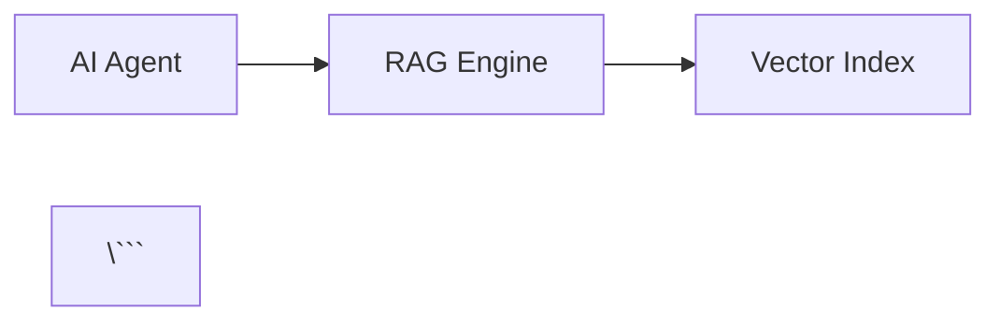
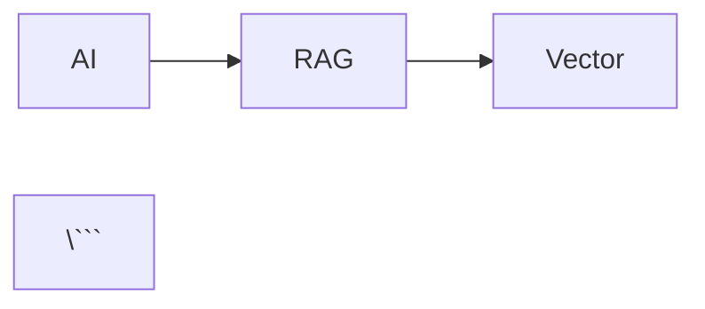

# Documentation Diagram Standards

**Keywords for search**: documentation diagrams, React diagram components, custom diagrams, not ASCII diagrams, not Mermaid, diagram standards, visual documentation, component-based diagrams, theming diagrams, consistent diagram style

---

## 🎯 TL;DR - Diagram Standards Quick Reference

**Critical diagram rules:**

1. **Use custom React components** for all diagrams
2. **Never use ASCII diagrams** in documentation
3. **Never use Mermaid** for diagrams (theming issues, inconsistent appearance)
4. **Follow existing component patterns** (`StandardsFlowDiagram.tsx`, `DataFlowDiagram.tsx`, `RAGQueryFlow.tsx`)
5. **Use CSS modules** for consistent styling

**Keywords for search**: React diagram components, custom diagrams not ASCII, not Mermaid diagrams, component-based visualizations, diagram theming, consistent visual style

**When to apply**: Creating new diagrams, replacing existing ASCII diagrams, visualizing architecture or flows

**Existing diagram components:** `docs/src/components/StandardsFlowDiagram.tsx`, `DataFlowDiagram.tsx`, `RAGQueryFlow.tsx`

---

## Purpose

Maintain professional, consistent, themeable diagram appearance across all prAxIs OS documentation by using custom React components instead of ASCII art or Mermaid diagrams. Ensure diagrams work seamlessly with site theming and provide a modern user experience.

---

## When to Use React Components vs Docusaurus Admonitions

### React Components (Orange HoneyHive Branding)

**Use for:** Core conceptual diagrams that are central to page understanding

**Examples:**
- Architecture overviews
- System flow diagrams explaining main concepts
- Key comparisons (Traditional vs prAxIs OS, Before vs After)
- Process flows that illustrate core ideas
- Multi-step workflows that are the focus of the page
- Visual hierarchies and relationships

**Visual style:** 
- Orange borders (`var(--honeyhive-orange-border)`)
- Dark backgrounds (`var(--ifm-background-surface-color)`)
- Prominent placement in content flow
- Custom styling with `.module.css` files

**When to create:** If the diagram is explaining **the main concept** the page is teaching, use a React component.

### Docusaurus Admonitions (Blue/Teal Callouts)

**Use for:** Supplementary information, tips, notes, warnings, and supporting examples

**Examples:**
- Code examples and patterns
- Quick reference tips
- Important notes or warnings
- Supplementary explanations
- Best practices reminders
- Command examples
- Configuration snippets

**Visual style:**
- Blue/teal borders (HoneyHive brand consistency)
- Subtle backgrounds
- Supporting content placement
- Built-in Docusaurus styling

**Admonition types:**
```markdown
:::info
Core information or process flows (use for most cases)
:::

:::tip
Helpful suggestions or best practices
:::

:::note
Additional context or clarifications
:::

:::warning
Important caveats or gotchas
:::
```

**When to use:** If the content is **supporting the main concept** with examples, tips, or supplementary information, use an admonition.

### Decision Framework

**Ask yourself:** "Is this diagram explaining a **core concept** of the page, or is it **supporting information**?"

- **Core concept** → React component with orange HoneyHive branding
- **Supporting info** → Docusaurus admonition with blue/teal styling

**Consistency rule:** Similar content types should use the same presentation across all pages. If you use a React component for a "3-layer system flow" on one page, use React components for similar flows on other pages.

**Examples from prAxIs OS docs:**

| Content Type | Presentation | Reasoning |
|--------------|--------------|-----------|
| Context degradation comparison (Message 1 vs 30) | React component | Core concept explaining RAG necessity |
| RAG efficiency comparison (3 approaches) | React component | Core concept showing system advantage |
| Behavioral pattern examples | Admonition | Supporting examples of concepts |
| Query construction tips | Admonition | Supplementary guidance |
| Layer 1/2/3 system flows | React component | Core concepts explaining the main system |
| Bash measurement commands | Code block | Actual executable commands |

---

## The Problem

**Without diagram standards:**
- ASCII diagrams look unprofessional and break in different fonts/widths
- Mermaid theming is difficult and produces inconsistent appearance
- Mixed diagram styles create visual confusion
- Diagrams don't respect site theme (light/dark mode)
- Maintenance becomes difficult with multiple diagram formats
- Mobile responsiveness suffers with fixed-width ASCII

**Real-world pain points:**
- ASCII diagrams: `→`, `│`, `├──` characters misalign across displays
- Mermaid: Theme conflicts, rendering inconsistencies, complex configuration
- No standard pattern leads to one-off solutions each time
- Visual quality doesn't match professional documentation standards

---

## The Standard

### Use Custom React Components for All Diagrams

**Create React components in `docs/src/components/`:**

```tsx
// docs/src/components/YourDiagram.tsx
import React from 'react';
import styles from './YourDiagram.module.css';

export default function YourDiagram(): React.ReactElement {
  return (
    <div className={styles.container}>
      {/* Your diagram structure */}
    </div>
  );
}
```

**With accompanying CSS module:**

```css
/* docs/src/components/YourDiagram.module.css */
.container {
  /* Styling that respects Docusaurus theme */
}
```

### Never Use ASCII Diagrams

❌ **Don't do this:**

```markdown
    ┌─────────────┐
    │  AI Agent   │
    └──────┬──────┘
           │
           ▼
    ┌─────────────┐
    │ RAG Engine  │
    └─────────────┘
```

**Problems:**
- Breaks with different fonts
- Not responsive
- Ugly on mobile
- Can't theme
- Hard to maintain

✅ **Do this instead:**

```tsx
import RAGQueryFlow from '@site/src/components/RAGQueryFlow';

<RAGQueryFlow />
```

### Never Use Mermaid

❌ **Don't do this:**

```markdown


**Problems:**
- Theming is a pain to configure
- Appearance inconsistent with site design
- Doesn't look as nice as custom React components
- Less control over styling

✅ **Do this instead:**

Create custom React component with full styling control.

### Follow Existing Component Patterns

**Study these examples:**

1. **`StandardsFlowDiagram.tsx`** - Multi-tier layout with cards
2. **`DataFlowDiagram.tsx`** - Horizontal flow with arrows (compact)
3. **`RAGQueryFlow.tsx`** - Linear flow diagram (compact)

**Pattern observations:**

- **Compact diagrams** use `CompactDiagram.module.css`
- **Complex diagrams** use dedicated CSS modules
- **Icons** use emoji (🤖, 🔍, ⚙️) for visual clarity
- **Arrows** use CSS for consistent rendering (`→`)
- **Colors** use CSS classes (`.cardBlue`, `.cardPurple`, etc.)

### Component Structure Pattern

**Standard React diagram structure:**

```tsx
import React from 'react';
import styles from './YourDiagram.module.css';

export default function YourDiagram(): React.ReactElement {
  return (
    <div className={styles.container}>
      {/* Main container */}
      
      <div className={styles.section}>
        {/* Logical section */}
        
        <div className={styles.box}>
          <span className={styles.icon}>🎯</span>
          <span className={styles.label}>Label</span>
        </div>
        
        <span className={styles.arrow}>→</span>
        
        <div className={styles.box}>
          <span className={styles.icon}>✨</span>
          <span className={styles.label}>Another</span>
        </div>
      </div>
    </div>
  );
}
```

**Key elements:**
- Semantic structure (container → section → box)
- Icons for visual identification
- Labels for clarity
- Arrows for flow direction
- CSS classes for theming

### CSS Module Pattern

**Standard CSS module structure:**

```css
/* Respect Docusaurus theme variables */
.container {
  margin: 2rem 0;
  padding: 1.5rem;
  background: var(--ifm-background-surface-color);
  border-radius: 8px;
}

.box {
  display: inline-flex;
  align-items: center;
  gap: 0.5rem;
  padding: 0.75rem 1.5rem;
  background: var(--ifm-color-emphasis-100);
  border: 1px solid var(--ifm-color-emphasis-300);
  border-radius: 6px;
}

.icon {
  font-size: 1.5rem;
}

.label {
  font-weight: 500;
  color: var(--ifm-font-color-base);
}

.arrow {
  margin: 0 1rem;
  font-size: 1.5rem;
  color: var(--ifm-color-emphasis-600);
}
```

**Key practices:**
- Use Docusaurus CSS variables (`--ifm-*`)
- Respect theme colors (light/dark mode)
- Semantic spacing (rem units)
- Flexible layouts (flexbox, grid)

### Usage in Documentation

**Import and use in MDX files:**

```mdx
---
title: Architecture Overview
---

import YourDiagram from '@site/src/components/YourDiagram';

## System Architecture

<YourDiagram />

The diagram above shows...
```

**Docusaurus alias:** `@site` maps to `docs/src/`

---

## Checklist

**Before creating a new diagram:**

- [ ] Checked existing components for reuse (`StandardsFlowDiagram`, `DataFlowDiagram`, `RAGQueryFlow`)
- [ ] Confirmed ASCII/Mermaid won't work (they never do - use React)
- [ ] Designed diagram structure (boxes, arrows, flow)
- [ ] Chosen appropriate existing pattern (compact vs complex)

**When creating React diagram component:**

- [ ] Created `.tsx` file in `docs/src/components/`
- [ ] Created `.module.css` file for styles
- [ ] Used Docusaurus CSS variables (`--ifm-*`)
- [ ] Included emoji icons for visual clarity
- [ ] Tested in light and dark themes
- [ ] Made responsive for mobile
- [ ] Followed existing naming patterns

**When using diagram in docs:**

- [ ] Imported component in MDX file
- [ ] Placed diagram near relevant content
- [ ] Provided context (caption or explanation)
- [ ] Verified rendering in dev server

---

## Examples

### Example 1: Simple Linear Flow (Compact)

**Component:** `RAGQueryFlow.tsx`

```tsx
import React from 'react';
import styles from './CompactDiagram.module.css';

export default function RAGQueryFlow(): React.ReactElement {
  return (
    <div className={styles.compactFlow}>
      <div className={styles.flowBox}>
        <span className={styles.flowIcon}>🤖</span>
        <span className={styles.flowLabel}>AI Agent</span>
      </div>
      
      <span className={styles.flowArrow}>→</span>
      
      <div className={styles.flowBox}>
        <span className={styles.flowIcon}>🔍</span>
        <span className={styles.flowLabel}>MCP Server</span>
      </div>
      
      <span className={styles.flowArrow}>→</span>
      
      <div className={styles.flowBox}>
        <span className={styles.flowIcon}>📊</span>
        <span className={styles.flowLabel}>Vector Index</span>
      </div>
      
      <span className={styles.flowArrow}>→</span>
      
      <div className={styles.flowBox}>
        <span className={styles.flowIcon}>✨</span>
        <span className={styles.flowLabel}>2-5KB Context</span>
      </div>
    </div>
  );
}
```

**Usage in docs:**

```mdx
import RAGQueryFlow from '@site/src/components/RAGQueryFlow';

## How RAG Works

<RAGQueryFlow />

The RAG query flow shows how AI agents retrieve targeted context...
```

### Example 2: Multi-Tier Layout (Complex)

**Component:** `StandardsFlowDiagram.tsx`

```tsx
import React from 'react';
import styles from './StandardsFlowDiagram.module.css';

export default function StandardsFlowDiagram(): React.ReactElement {
  return (
    <div className={styles.container}>
      <div className={styles.tier}>
        <h3 className={styles.tierTitle}>Universal Standards</h3>
        <div className={styles.tierSubtitle}>Static, Timeless</div>
        <div className={styles.grid}>
          <div className={`${styles.card} ${styles.cardBlue}`}>
            <div className={styles.cardIcon}>🔒</div>
            <div className={styles.cardTitle}>Race Conditions</div>
          </div>
          {/* More cards */}
        </div>
      </div>

      <div className={styles.arrow}>
        <div className={styles.arrowLine}></div>
        <div className={styles.arrowLabel}>LLM Generation</div>
        <div className={styles.arrowHead}>→</div>
      </div>

      <div className={styles.tier}>
        {/* Second tier */}
      </div>
    </div>
  );
}
```

**When to use:** Complex diagrams with multiple sections, hierarchies, or groupings.

### Example 3: Split Flow (Compact)

**Component:** `DataFlowDiagram.tsx`

```tsx
export default function DataFlowDiagram(): React.ReactElement {
  return (
    <div className={styles.compactFlow}>
      <div className={styles.flowBox}>
        <span className={styles.flowIcon}>🤖</span>
        <span className={styles.flowLabel}>Cursor Agent</span>
      </div>
      
      <span className={styles.flowArrow}>→</span>
      
      <div className={`${styles.flowBox} ${styles.flowBoxWide}`}>
        <div className={styles.splitBox}>
          <div className={styles.splitItem}>
            <span className={styles.flowIcon}>🔍</span>
            <span className={styles.flowLabel}>RAG Engine</span>
          </div>
          <div className={styles.splitDivider}></div>
          <div className={styles.splitItem}>
            <span className={styles.flowIcon}>⚙️</span>
            <span className={styles.flowLabel}>Workflow Engine</span>
          </div>
        </div>
      </div>
      
      {/* Rest of flow */}
    </div>
  );
}
```

**When to use:** Flow splits into parallel paths or shows dual components.

---

## Anti-Patterns

### ❌ ASCII Diagrams

```markdown
AI Agent → RAG Engine → Vector Store
    ↓           ↓            ↓
Context     Chunks       Embeddings
```

**Problem:** Looks unprofessional, breaks on mobile, can't theme.

**Fix:** Create React component with proper CSS.

### ❌ Mermaid Diagrams

```markdown


**Problem:** Theming difficult, inconsistent appearance.

**Fix:** Use custom React component for full control.

### ❌ Inline SVG Without Component

```markdown
<svg width="400" height="200">
  <rect x="10" y="10" width="100" height="50" />
  {/* 50 more lines */}
</svg>
```

**Problem:** Hard to maintain, no CSS modules, pollutes MDX.

**Fix:** Extract to React component with CSS module.

### ❌ Hardcoded Colors

```tsx
<div style={{background: '#1a1a1a', color: '#ffffff'}}>
  Diagram box
</div>
```

**Problem:** Doesn't respect theme, breaks in light mode.

**Fix:** Use Docusaurus CSS variables:

```tsx
<div className={styles.box}>
  Diagram box
</div>
```

```css
.box {
  background: var(--ifm-background-surface-color);
  color: var(--ifm-font-color-base);
}
```

### ❌ No Reusability

Creating one-off styles for every diagram instead of sharing patterns.

**Fix:** Use `CompactDiagram.module.css` for simple flows, create new module only when needed.

---

## Frequently Asked Questions

**Can I ever use ASCII diagrams?**
→ No. Always use React components for professional appearance and theming.

**What about Mermaid?**
→ No. Theming is problematic and custom React looks better.

**When should I create a new CSS module vs reuse existing?**
→ Reuse `CompactDiagram.module.css` for simple linear/split flows. Create new module for complex multi-section layouts.

**How do I make diagrams responsive?**
→ Use flexbox/grid with relative units (rem, %), test on mobile. See existing components for patterns.

**What icons should I use?**
→ Emoji work great for documentation diagrams (🤖, 🔍, ⚙️, 📊, ✨). Avoid custom icon libraries unless already in project.

**How do I test theme compatibility?**
→ Toggle Docusaurus light/dark mode and verify diagram colors respect theme.

**Can I use external diagram libraries?**
→ Avoid adding dependencies. Custom React components are lightweight and give full control.

---

## Related Standards

- `documentation-project-naming.md` - Use "prAxIs OS" in diagram labels
- `rag-content-authoring.md` - Ensure diagrams have descriptive captions for context
- `standards-creation-process.md` - Follow RAG optimization for diagram explanations

---

## Maintenance

**Update this standard when:**
- New diagram pattern emerges (e.g., vertical timeline)
- Docusaurus updates theme system
- Accessibility requirements change
- New reusable diagram types identified

**Periodic review:**
- Audit existing diagrams for consistency
- Update outdated patterns
- Add new examples as created

**Last reviewed:** 2025-10-13

---

