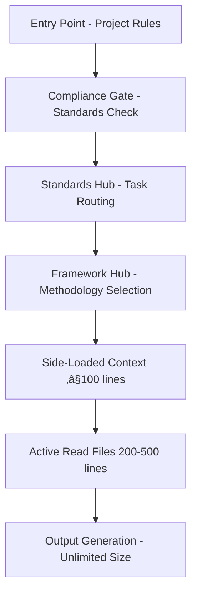

| **Async Evaluations** | ‚ùå Explicitly disabled ("cannot be run async") | ‚úÖ Full async support with @aevaluator | ‚úÖ New capability |
| **Built-in Evaluators** | Basic @evaluator/@aevaluator decorators | ‚úÖ Accuracy, F1, length, quality, custom classes | ‚úÖ Enhanced framework |
| **Threading Support** | Manual ThreadPoolExecutor setup | ‚úÖ Configurable parallel execution (max_workers) | ‚úÖ Enhanced automation |

**LLM Integration**:

| Feature | Main Branch | Complete-Refactor | Enhancement |
|---------|-------------|------------------|-------------|
| **Provider Support** | Traceloop-sdk v0.42.0 (fixed version) | OpenAI, Anthropic, Google AI, AWS Bedrock, Azure, MCP | ‚úÖ Expanded ecosystem |
| **Integration Architecture** | Monolithic with forced traceloop dependency | BYOI with OpenInference/Traceloop/Custom | ‚úÖ Flexible architecture |
| **Multi-Provider** | ‚ùå Single traceloop instance | ‚úÖ Simultaneous tracing across providers | ‚úÖ New capability |
| **Zero Code Changes** | ‚ùå Requires traceloop initialization | ‚úÖ Automatic instrumentation | ‚úÖ Enhanced UX |
| **Rich Metadata** | Basic traceloop attributes | Detailed spans with tokens, costs, latency | ‚úÖ Enhanced observability |

#### **Quality & Production Readiness**

| Metric | Main Branch | Complete-Refactor | AI-Assisted Achievement |
|--------|-------------|------------------|----------------------|
| **Constructor Parameters** | 16 parameters (basic validation) | 16 backward-compatible parameters + Pydantic config | ‚úÖ Enhanced compatibility |
| **Configuration System** | Environment variables only | Pydantic config + environment variables + validation | ‚úÖ Enterprise-grade config |
| **Error Handling** | Basic try/catch with verbose flag | Graceful degradation + comprehensive logging | ‚úÖ Production resilience |
| **Performance Features** | Basic HTTP with requests/httpx | Connection pooling, keep-alive, timeouts, rate limiting | ‚úÖ Production optimization |
| **SSL/TLS Support** | Basic HTTPS | Corporate environment SSL with custom certificates | ‚úÖ Enterprise security |
| **Test Framework** | 31 basic test files | 179 test files with integration + unit + performance | ‚úÖ 5.8x more comprehensive |

#### **Development & Maintenance**

| Aspect | Main Branch | Complete-Refactor | Methodology Impact |
|--------|-------------|------------------|-------------------|
| **Code Quality** | Speakeasy-generated code (no quality metrics) | 10.0/10 Pylint, 0 MyPy errors | ‚úÖ Systematic quality gates |
| **Documentation** | Basic API docs | Sphinx docs with LLM-managed updates + pre-commit enforcement | ‚úÖ AI-maintained documentation |
| **CLI Support** | Basic CLI with eval command | Full CLI with commands and options | ‚úÖ Enhanced tooling |
| **Agent OS Framework** | ‚ùå Not available | ‚úÖ Complete methodology documentation | ‚úÖ Transferable approach |
| **Pre-commit Hooks** | ‚ùå Not available | Comprehensive validation pipeline | ‚úÖ Automated quality |

#### **AI-Assisted Documentation System**

**Sphinx Documentation with LLM Management**:
- **Automated Updates**: LLM maintains documentation in sync with code changes
- **Pre-commit Enforcement**: Documentation updates required before commits pass
- **Quality Assurance**: Sphinx validation ensures proper RST formatting and cross-references
- **Comprehensive Coverage**: BYOI architecture, multi-instance patterns, evaluation framework fully documented
- **Live Maintenance**: Documentation evolves with codebase through AI assistance

**Documentation Quality Metrics**:
- **Files**: Comprehensive Sphinx documentation tree with tutorials, how-to guides, reference docs
- **Automation**: Pre-commit hooks enforce documentation compliance
- **Validation**: Automated RST syntax checking and link validation
- **Maintenance**: LLM-driven updates ensure docs stay current with code changes

**Summary**: The complete-refactor branch represents a **complete architectural transformation** achieved through systematic AI-assisted development, delivering enterprise-grade capabilities while maintaining 100% backward compatibility. The documentation system itself demonstrates AI-assisted automation with LLM-managed Sphinx docs and pre-commit enforcement.

## **🤖 COMPREHENSIVE LLM INTEGRATION ECOSYSTEM**

### **Beyond Deterministic Output: Full Development Automation**

The HoneyHive Python SDK represents a **complete LLM-integrated development ecosystem** that extends far beyond just deterministic output methodology. This is a **comprehensive AI-assisted development platform** with systematic automation at every level:

#### **🏗️ prAxIs OS: Complete AI Development Framework**

**Agent OS Structure** (198 AI-optimized files):
- **üìã Standards Hierarchy**: 4-tier documentation system with automatic discovery paths
- **üß™ Test Generation Framework**: V3 framework with 65 phase files + 31 task files + command glossary
- **🏗️ Production Code Framework**: V2 modular system with complexity-based paths
- **üìö Documentation Generation**: Template-driven system with 8 provider configs
- **üîí Quality Enforcement**: Autonomous validation with 20+ active specifications

#### **üö® Pre-Commit Hook Ecosystem: 11 Automated Quality Gates**

**Structural Validation**:
1. **No Mocks in Integration Tests** - Enforces real API usage
2. **Invalid Tracer Pattern Check** - Prevents deprecated patterns

**Code Quality Automation**:
3. **Tox Format Check** - Black + isort formatting
4. **Tox Lint Check** - Pylint + MyPy validation

**Test Suite Execution**:
5. **Unit Test Suite** - Fast, mocked validation
6. **Integration Tests Basic** - Real API credential checking

**Documentation Automation**:
7. **Docs Build Check** - Sphinx compilation with warnings as errors
8. **Docs Navigation Validation** - Link integrity and toctree validation
9. **Feature Documentation Sync** - Automatic feature catalog synchronization
10. **Documentation Compliance Check** - CHANGELOG enforcement and reference doc updates

**Pattern Enforcement**:
11. **YAML Validation** - Configuration file syntax checking

#### **üìö LLM-Managed Documentation System**

**Template Generation Engine**:
- **🎯 Provider Documentation Generator**: 8 pre-configured providers (OpenAI, Anthropic, Google AI, Bedrock, etc.)
- **üìã Template Variables System**: 50+ configurable template variables per provider
- **üîß Multi-Instrumentor Support**: OpenInference + Traceloop dual-path generation
- **⚙️ Environment Configuration**: Automatic environment variable documentation

**Quality Control Scripts**:
- **üìä Sphinx Documentation Quality Control**: 5,000+ line unified validation system
- **üîç Navigation Validator**: Dynamic page discovery with link validation
- **üìã Feature Synchronization**: Automatic feature catalog maintenance
- **üö® Documentation Compliance**: CHANGELOG enforcement with emergency bypass

#### **üß™ Advanced Testing Automation**

**Test Generation Framework V3**:
- **üìã Command Language Glossary**: 25 standardized LLM commands (`üõë EXECUTE-NOW`, `üìä QUANTIFY-RESULTS`, etc.)
- **🎯 Quality Targets**: 100% pass rate + 90%+ coverage + 10.0/10 Pylint + 0 MyPy errors
- **‚ö° Phase Navigation**: 8-phase structured generation with checkpoints
- **🔄 Evidence-Based Validation**: Automated quality gate enforcement

**Integration Testing Strategy**:
- **üö´ No-Mock Policy**: Real API integration testing enforced by pre-commit hooks
- **üîß Credential Validation**: Automatic API key checking in CI/CD
- **üìä Compatibility Matrix**: Multi-provider testing framework

#### **üîß Development Workflow Automation**

**CI/CD Path Detection**:
- **🎯 Smart Workflow Triggers**: Path-based exclusions prevent unnecessary runs
- **‚ö° Resource Optimization**: prAxIs OS spec changes don't trigger full test suites
- **üìä Workflow Efficiency**: Reduced CI/CD noise and faster feedback cycles

**Git Safety Enforcement**:
- **🛡️ Forbidden Operations**: `git commit --no-verify` blocked by prAxIs OS standards
- **üìã Commit Message Standards**: Structured commit validation
- **üîí Quality Gate Enforcement**: Pre-commit hooks cannot be bypassed

#### **üìä Quantified LLM Integration Metrics**

**Agent OS Framework Scale**:
- **198 AI-optimized files** in code generation frameworks
- **65 phase files** + **31 task files** in V3 test generation
- **25 standardized LLM commands** in command glossary
- **11 automated pre-commit hooks** with quality enforcement
- **8 provider configurations** with 50+ template variables each
- **20+ active specifications** with implementation guidance

**Documentation Automation Scale**:
- **5,000+ line documentation quality control system**
- **Dynamic page discovery** with automatic link validation
- **Template-driven generation** for consistent multi-provider docs
- **Sphinx integration** with warnings-as-errors enforcement

**Quality Enforcement Scale**:
- **100% pass rate** + **90%+ coverage** + **10.0/10 Pylint** + **0 MyPy errors**
- **Real API integration testing** with no-mock policy enforcement
- **Automatic CHANGELOG updates** required for significant changes
- **Feature catalog synchronization** between docs and codebase

### **üöÄ LLM Integration Architecture Patterns**

#### **1. Discovery-Driven AI Guidance**
- **Hierarchical Documentation**: 4-tier system with automatic discovery paths
- **Context Side-Loading**: ≤100 line files automatically injected for systematic execution
- **Active Read References**: 200-500 line files for detailed guidance
- **Command Language API**: Standardized LLM control language for binding obligations

#### **2. Quality-First Automation**
- **Pre-Commit Enforcement**: 11 automated quality gates that cannot be bypassed
- **Evidence-Based Validation**: Automated quality measurement and reporting
- **Autonomous Testing**: LLM-generated tests with systematic quality enforcement
- **Real-World Integration**: No-mock policy ensures production-ready validation

#### **3. Template-Driven Consistency**
- **Provider Documentation**: Systematic generation for 8+ LLM providers
- **Code Generation**: Template-based production code with complexity assessment
- **Test Generation**: Structured framework with phase-based execution
- **Documentation Templates**: Consistent multi-instrumentor integration patterns

#### **4. Systematic Development Acceleration**
- **Path-Based CI/CD**: Smart workflow triggers reduce unnecessary compute
- **Automated Documentation**: LLM maintains Sphinx docs with pre-commit enforcement
- **Feature Synchronization**: Automatic catalog updates between code and docs
- **Quality Gate Automation**: Systematic enforcement without manual intervention

### **🎯 Transferability and Reusability**

This comprehensive LLM integration ecosystem demonstrates:

1. **🔄 Cross-Project Transferability**: prAxIs OS patterns applicable to any codebase
2. **üåê Cross-Language Adaptability**: Framework concepts work beyond Python
3. **üìà Scalable Quality Enforcement**: Systematic automation scales with project complexity
4. **🤖 AI-Assisted Development Evolution**: LLM implementing and optimizing its own methodology
5. **🏗️ Enterprise-Grade Automation**: Production-ready quality gates and validation systems

**This represents a complete paradigm shift from "AI as a coding assistant" to "AI as a systematic development partner" with comprehensive automation, quality enforcement, and architectural guidance.**

#### **Transfer Readiness Validation**
The methodology successfully demonstrated:
1. **Self-Implementation**: LLM successfully implemented its own optimization framework
2. **Quality Consistency**: Systematic achievement of all quality targets
3. **Documentation Completeness**: Full methodology capture during development
4. **Live Evolution Capability**: Methodology improves through application
5. **Transferability Proof**: Clear patterns for cross-project implementation

---

## 13. **CONCLUSION & ENGINEERING PRINCIPLES**

### **Core Engineering Insights**

1. **LLM Constraints Drive Architecture**: Context window limitations necessitate horizontal scaling
2. **Binding Interfaces Enable Determinism**: Command language creates enforceable obligations
3. **Systematic Validation Prevents Drift**: Automated quality gates maintain consistency
4. **Evidence-Based Progress Ensures Quality**: Quantified metrics prevent subjective assessments

### **Transferable Engineering Patterns**

| Pattern | Applicability | Implementation | Benefits |
|---------|---------------|----------------|----------|
| **Discovery Flow Architecture** | Any multi-step LLM workflow | Entry ‚Üí Compliance ‚Üí Routing ‚Üí Execution | Consistent navigation, reduced failure rates |
| **Command Language Interface** | Complex instruction sets requiring compliance | Binding command vocabulary with validation | Reduced ambiguity, improved compliance |
| **Three-Tier File Architecture** | Workflows requiring context optimization | Side-loaded ‚Üí Active Read ‚Üí Output generation | Context efficiency, attention quality preservation |
| **Automated Quality Gates** | Any workflow requiring quality assurance | Programmatic validation with exit codes | Consistent quality, reduced manual oversight |

### **Success Criteria for Implementation**

A successful implementation should demonstrate:
- **80%+ consistency** in output quality across multiple executions
- **60%+ reduction** in context window utilization per phase
- **90%+ compliance** with instruction sets using command language
- **Automated validation** achieving exit code 0 for quality gates

### **Engineering Methodology Summary**

This methodology transforms LLM workflows from unpredictable prompt engineering into systematic, API-like processes with measurable quality guarantees through:

1. **Constraint-Aware Architecture**: Design decisions based on empirical LLM limitations
2. **Programmatic Interface Design**: Command language creating binding execution contracts
3. **Systematic Quality Enforcement**: Automated validation preventing quality degradation
4. **Evidence-Based Validation**: Quantified metrics ensuring objective assessment

The approach provides a reusable engineering framework for creating deterministic, high-quality LLM workflows across diverse application domains.

<environment_details>
# Cursor Visible Files
../../../../Library/Application Support/Cursor/User/globalStorage/saoudrizwan.claude-dev/settings/cline_mcp_settings.json

# Cursor Open Tabs
../../../../Library/Application Support/Cursor/User/globalStorage/saoudrizwan.claude-dev/settings/cline_mcp_settings.json

# Current Time
10/10/2025, 10:30:40 PM (America/Los_Angeles, UTC-7:00)

# Context Window Usage
131,613 / 200K tokens used (66%)

# Current Mode
ACT MODE
</environment_details>

---

**Assistant:**

[Unexpected content type]

<read_file>
<path>../python-sdk/.praxis-os/standards/ai-assistant/DETERMINISTIC-LLM-OUTPUT-METHODOLOGY.md</path>
<task_progress>
- [x] Read Python SDK case study (origin story)
- [x] Read operating model (collaboration pattern)
- [x] Read LLM workflow engineering methodology (technical foundation)
- [ ] Read deterministic output methodology
- [ ] Synthesize complete understanding
</task_progress>
</read_file>

---

**User:**

[read_file for '../python-sdk/.praxis-os/standards/ai-assistant/DETERMINISTIC-LLM-OUTPUT-METHODOLOGY.md'] Result:
# Deterministic LLM Output Methodology

**🎯 A Systematic Approach to Making Large Language Model Output Predictable and High-Quality**

*This document establishes a repeatable methodology for creating deterministic, high-quality LLM workflows. Developed through the V3 Test Generation Framework, these principles can be applied to any complex LLM-driven process requiring consistent, reliable output.*

---

## üìã **EXECUTIVE SUMMARY**

### **The Core Challenge**
Large Language Models are inherently non-deterministic, leading to inconsistent output quality and unpredictable results in complex workflows. Traditional approaches rely on prompt engineering alone, which fails to scale to sophisticated, multi-step processes.

### **The Solution Framework**
A systematic methodology combining **Agent OS principles**, **LLM constraint awareness**, **structured specifications**, and **horizontally scaled task decomposition** to create "APIs for LLM-delivered high-quality output."

### **Key Innovation**
**Separation of Concerns**: Small, structured instructions (LLM consumes) ‚Üí Systematic execution process (LLM follows) ‚Üí Large, comprehensive output (LLM produces)

---

## 🧠 **LLM STRENGTHS & WEAKNESSES ANALYSIS**

### **LLM Strengths (Leverage These)**
```python
strengths = {
    "pattern_recognition": "Excellent at identifying and applying patterns",
    "contextual_understanding": "Can understand complex requirements and context",
    "code_generation": "Strong at producing syntactically correct, functional code",
    "systematic_execution": "Can follow detailed, structured instructions reliably",
    "iterative_refinement": "Effective at improving output through feedback loops",
    "cross_domain_knowledge": "Can apply knowledge across different domains",
    "targeted_operations": "Excels at focused modifications to large codebases"
}
```

### **LLM Weaknesses (Design Around These)**
```python
weaknesses = {
    "consistency": "Output varies between identical requests",
    "context_limits": "Cannot process unlimited information simultaneously",
    "surface_analysis": "May miss critical details without structured guidance",
    "completion_claims": "Often claims completion without thorough validation",
    "scope_creep": "Tendency to jump ahead or skip systematic steps",
    "quality_variance": "Output quality fluctuates without enforcement mechanisms",
    "memory_limitations": "Cannot maintain perfect context across long sessions"
}
```

### **Design Principles Based on Analysis**
1. **Structure compensates for inconsistency** ‚Üí Systematic frameworks
2. **Small files compensate for context limits** ‚Üí Horizontally scaled documentation
3. **Explicit steps compensate for surface analysis** ‚Üí Detailed phase breakdown
4. **Validation gates compensate for completion claims** ‚Üí Automated quality checks
5. **Sequential requirements compensate for scope creep** ‚Üí Mandatory phase dependencies
6. **Enforcement mechanisms compensate for quality variance** ‚Üí Automated validation
7. **External memory compensates for memory limitations** ‚Üí Persistent documentation

---

## 🏗️ **AGENT OS DISCOVERY-DRIVEN ARCHITECTURE**

### **Agent OS Core Principles Applied**
```yaml
Systematic_Approach:
  principle: "Structured, repeatable processes over ad-hoc solutions"
  implementation: "Multi-phase frameworks with clear dependencies"
  
Spec_Driven_Development:
  principle: "Comprehensive specifications before implementation"
  implementation: "Detailed API specifications for LLM workflows"
  
Compliance_First_Execution:
  principle: "Check existing standards before creating new approaches"
  implementation: "Mandatory compliance gates and discovery flows"
  
Quality_Gates:
  principle: "Automated validation at every stage"
  implementation: "Programmatic quality enforcement with exit codes"
  
Evidence_Based_Progress:
  principle: "Quantified results over subjective assessments"
  implementation: "Measurable outputs with documented evidence"
  
Horizontal_Scaling:
  principle: "Break complex problems into manageable components"
  implementation: "Small, focused files that compose into comprehensive systems"
```

### **Discovery Flow Architecture Pattern**


**Reusable Pattern**: Any complex LLM workflow should implement this funnel architecture - wide entry through compliance gates to focused execution with unlimited output generation.

### **Agent OS Adaptation for LLM Workflows**
```python
# Traditional prAxIs OS (Human-Centric)
praxis_os_traditional = {
    "specs": "Comprehensive documents (500-2000 lines)",
    "tasks": "Complex, multi-faceted requirements", 
    "execution": "Human interpretation and adaptation",
    "validation": "Manual review and iteration"
}

# LLM-Optimized prAxIs OS (AI-Centric)
praxis_os_llm_optimized = {
    "specs": "Modular documents (<100-150 lines each)",
    "tasks": "Single-responsibility, focused requirements",
    "execution": "Systematic, step-by-step instruction following",
    "validation": "Automated quality gates with programmatic enforcement"
}
```

---

## üìê **SPECIFICATION-DRIVEN METHODOLOGY**

### **Three-Tier Discovery-Driven Architecture**

#### **Tier 1: Side-Loaded Context Files (≤100 lines)**
```markdown
Purpose: Systematic execution instructions automatically injected into AI context
Size: ≤100 lines for optimal AI processing (context side-loading limitations)
Discovery: Entry Point ‚Üí Compliance ‚Üí Hub ‚Üí Framework Core ‚Üí Side-Loaded Files
AI Consumption: Read during systematic execution phases
Content:
- Single-phase or single-concept instructions
- Specific commands and validation criteria
- Clear success/failure conditions
- Sequential dependencies
Example: unit-path.md, phase-navigation.md
```

#### **Tier 2: Active Read Files (200-500 lines, ideally ~250)**
```markdown
Purpose: Comprehensive context establishment and detailed methodology guidance
Size: 200-500 lines for focused reading sessions (one-time consumption)
Discovery: Referenced from Tier 1 files via explicit links
AI Consumption: On-demand focused reading when directed by side-loaded files
Content:
- Complete methodology explanation
- Architecture overview
- Success criteria and quality targets
- Integration points and dependencies
Example: framework-core.md, AI-SESSION-FOUNDATION.md
```

#### **Tier 3: Output Artifacts (No size limits)**
```markdown
Purpose: Comprehensive deliverables generated following systematic guidance
Size: No limits - quality and completeness prioritized (AI generates but doesn't re-consume)
Quality Gates: Automated validation via programmatic enforcement scripts
AI Consumption: Generate using Tier 1 & 2 guidance, never re-consume (avoids context bloat)
Content:
- Generated code, documentation, analysis reports
- Comprehensive test suites
- Detailed specifications and designs
- Quality validation results
Example: Generated test files (1000+ lines), comprehensive documentation
```

### **Specification Development Process**
1. **Define Complete API** ‚Üí Comprehensive specification document
2. **Design Discovery Flow** ‚Üí Entry points, compliance gates, and routing
3. **Decompose into Phases** ‚Üí Small, focused instruction files
4. **Create Validation Gates** ‚Üí Automated quality enforcement
5. **Test and Iterate** ‚Üí Refine based on actual LLM execution
6. **Document Learnings** ‚Üí Update methodology for future workflows

---

## 🛡️ **COMPLIANCE-FIRST EXECUTION MODEL**

### **The Compliance Gate Pattern**
**Foundational Principle**: Every LLM workflow must begin with compliance checking to prevent reinventing existing solutions and ensure consistency with established patterns.

```python
# Universal compliance gate pattern for any LLM workflow
class ComplianceGate:
    def __init__(self, domain_standards):
        self.domain_standards = domain_standards
        
    def validate_pre_execution(self, task_request):
        compliance_checks = [
            self.check_existing_standards(task_request),
            self.verify_established_patterns(task_request),
            self.confirm_no_existing_solutions(task_request),
            self.validate_approach_necessity(task_request)
        ]
        
        compliance_score = sum(check.score for check in compliance_checks) / len(compliance_checks)
        
        if compliance_score < 80:
            raise ComplianceViolation("Must achieve 80%+ compliance or provide explicit justification")
            
        return ComplianceReport(score=compliance_score, checks=compliance_checks)
```

### **Mandatory Pre-Execution Gates**
**Reusable Pattern**: Any complex LLM workflow should implement these gates:

1. **Standards Discovery**: Check existing domain-specific patterns and approaches
2. **Compliance Verification**: Validate against established rules and conventions  
3. **Pattern Confirmation**: Use existing approaches before creating new ones
4. **Violation Detection**: Built-in safeguards against AI shortcuts and assumptions

### **Compliance Score Integration**
```python
compliance_scoring = {
    "100%": "Perfect compliance with existing standards",
    "80-99%": "Good compliance with minor justified deviations", 
    "60-79%": "Moderate compliance requiring explicit justification",
    "<60%": "Poor compliance requiring standards updates or approach change"
}
```

**Implementation Note**: The compliance gate serves as a quality filter that prevents LLMs from bypassing established domain knowledge and ensures consistency across workflow executions.

---

## 🔄 **HORIZONTALLY SCALED TASK DECOMPOSITION**

### **The File Size Strategy**

#### **Critical Insight: Different Files, Different Constraints**
```python
file_constraints = {
    "instruction_files": {
        "purpose": "AI reads these for systematic execution",
        "constraint": "<100 lines for optimal AI processing",
        "rationale": "Context side-loading limitations",
        "examples": ["phase-1-analysis.md", "template-patterns.md"]
    },
    "output_files": {
        "purpose": "AI generates these as deliverables", 
        "constraint": "No size limits - quality and completeness prioritized",
        "rationale": "AI creates but doesn't need to re-consume",
        "examples": ["generated_tests.py", "comprehensive_documentation.md"]
    },
    "foundation_files": {
        "purpose": "AI actively reads for context establishment",
        "constraint": "Reasonable size for focused reading (200-500 lines)",
        "rationale": "One-time consumption for understanding",
        "examples": ["methodology.md", "session-foundation.md"]
    }
}
```

#### **Horizontal Scaling Patterns**
```
# Instead of one large instruction file (AI-hostile)
massive-instructions.md (500+ lines) ‚ùå

# Use horizontally scaled, focused files (AI-friendly)
instructions/
├── phase-1/
│   ├── overview.md (50 lines)
│   ├── analysis-commands.md (75 lines)
│   └── validation-criteria.md (60 lines)
├── phase-2/
│   ├── overview.md (45 lines)
│   └── execution-steps.md (80 lines)
└── phase-3/
    ├── quality-gates.md (90 lines)
    └── enforcement.md (70 lines)
```

#### **Why Horizontal Scaling Works with Discovery Architecture**
```python
# LLM context window optimization strategy
context_optimization = {
    "discovery_phase": {
        "purpose": "Navigate through entry ‚Üí compliance ‚Üí hubs (one-time)",
        "cost": "High initial context consumption",
        "frequency": "Once per workflow session"
    },
    "execution_phase": {
        "purpose": "Side-load specific instructions (repeated)",
        "cost": "Low context consumption per phase",
        "frequency": "Multiple times per workflow"
    },
    "output_phase": {
        "purpose": "Generate without re-consuming (efficient)",
        "cost": "Zero context consumption for re-reading",
        "frequency": "Continuous during generation"
    }
}
```

**Cognitive Load Management Pattern**:
- **Single Responsibility**: Each file addresses one specific concept
- **Sequential Dependencies**: Clear phase ordering prevents overwhelm  
- **Evidence-Based Progress**: Quantified checkpoints prevent scope creep
- **Discovery vs Consumption Separation**: Navigate once, execute repeatedly

---

## 🔄 **HORIZONTAL SCALING DISCOVERY & DIRECTED TASK FLOW**

### **The Directed Task Flow Architecture**
**Core Innovation**: Instead of monolithic instructions, tasks are horizontally distributed across small, focused files that the discovery system directs the AI through systematically.


### **Horizontal Task Distribution Pattern**
```python
# Real V3 Framework Example: How tasks are horizontally distributed
horizontal_task_distribution = {
    "discovery_layer": {
        "entry_point": ".cursorrules (65 lines)",
        "compliance_gate": "compliance-checking.md (162 lines)",
        "task_routing": "ai-assistant/README.md (214 lines)",
        "framework_hub": "tests/README.md (373 lines)",
        "purpose": "Navigate AI to correct methodology"
    },
    
    "execution_layer": {
        "methodology_core": "v3/framework-core.md (246 lines)",
        "phase_navigation": "v3/phase-navigation.md (201 lines)", 
        "path_selection": "v3/paths/unit-path.md (331 lines)",
        "purpose": "Provide systematic execution instructions"
    },
    
    "phase_decomposition": {
        "phase_1": "phases/1/shared-analysis.md (~80 lines)",
        "phase_2": "phases/2/logging-analysis.md (~75 lines)",
        "phase_3": "phases/3/dependency-analysis.md (~90 lines)",
        "phase_4": "phases/4/usage-patterns.md (~85 lines)",
        "phase_5": "phases/5/coverage-analysis.md (~95 lines)",
        "phase_6": "phases/6/pre-generation.md (~70 lines)",
        "phase_7": "phases/7/post-generation.md (~60 lines)",
        "phase_8": "phases/8/quality-enforcement.md (~100 lines)",
        "purpose": "Break complex workflow into manageable, focused tasks"
    },
    
    "output_generation": {
        "test_files": "Generated artifacts (1000+ lines)",
        "documentation": "Comprehensive reports (unlimited)",
        "validation_results": "Quality metrics and evidence",
        "purpose": "Produce high-quality deliverables"
    }
}
```

### **Directed Task Flow Mechanism**
**How the AI is systematically guided through horizontally scaled tasks:**

#### **1. Discovery-Driven Navigation**
```python
# The AI follows explicit navigation instructions
navigation_flow = {
    "step_1": {
        "current_file": ".cursorrules",
        "instruction": "Check compliance FIRST",
        "next_file": "compliance-checking.md",
        "task_focus": "Validate existing standards"
    },
    "step_2": {
        "current_file": "compliance-checking.md", 
        "instruction": "Navigate to AI Assistant Standards Hub",
        "next_file": "ai-assistant/README.md",
        "task_focus": "Route to appropriate framework"
    },
    "step_3": {
        "current_file": "ai-assistant/README.md",
        "instruction": "Follow Test Generation Framework Hub",
        "next_file": "tests/README.md", 
        "task_focus": "Select V3 framework"
    },
    "step_4": {
        "current_file": "tests/README.md",
        "instruction": "Use V3 Framework Core",
        "next_file": "v3/framework-core.md",
        "task_focus": "Understand methodology"
    }
}
```

#### **2. Phase-by-Phase Task Direction**
```python
# Each phase explicitly directs to the next
phase_direction_pattern = {
    "phase_completion_requirement": "Update progress table with evidence",
    "next_phase_trigger": "Explicit instruction to proceed to next phase",
    "file_navigation": "Direct links to next phase file",
    "validation_gate": "Cannot proceed without completing current phase",
    
    "example_flow": {
        "phase_1_complete": "‚úÖ Phase 1: Method Verification complete ‚Üí Proceed to Phase 2",
        "phase_1_instruction": "Next: [Phase 2: Logging Analysis](phases/2/logging-analysis.md)",
        "phase_2_loads": "AI reads phases/2/logging-analysis.md (75 lines)",
        "phase_2_executes": "AI follows logging analysis instructions",
        "phase_2_validates": "AI provides evidence in progress table"
    }
}
```

#### **3. Context-Efficient Task Execution**
```python
# How horizontal scaling optimizes AI context usage
context_efficiency = {
    "traditional_monolithic": {
        "approach": "Load entire 2000+ line instruction file",
        "context_cost": "High - entire methodology in memory",
        "cognitive_load": "Overwhelming - too much information",
        "failure_rate": "High - AI gets lost in complexity"
    },
    
    "horizontal_scaling": {
        "approach": "Load only current phase instructions (60-100 lines)",
        "context_cost": "Low - focused task instructions only", 
        "cognitive_load": "Manageable - single responsibility focus",
        "failure_rate": "Low - clear, focused execution"
    },
    
    "directed_navigation": {
        "mechanism": "Each file explicitly points to next file",
        "benefit": "AI doesn't need to remember entire workflow",
        "result": "Systematic progression without cognitive overload"
    }
}
```

### **Real-World Task Flow Example (V3 Framework)**
```python
# Actual task flow through V3 framework horizontal architecture
v3_task_flow_example = {
    "task_request": "Generate unit tests for initialization.py",
    
    "flow_execution": [
        {
            "file": ".cursorrules",
            "task": "Route to compliance checking",
            "size": "65 lines",
            "focus": "Entry point navigation"
        },
        {
            "file": "compliance-checking.md", 
            "task": "Verify no existing tests, check standards",
            "size": "162 lines",
            "focus": "Standards validation"
        },
        {
            "file": "tests/README.md",
            "task": "Select V3 framework for test generation", 
            "size": "373 lines",
            "focus": "Framework selection"
        },
        {
            "file": "v3/framework-core.md",
            "task": "Understand V3 methodology and commit to contract",
            "size": "246 lines", 
            "focus": "Methodology foundation"
        },
        {
            "file": "v3/unit-path.md",
            "task": "Learn unit test strategy (mock external dependencies)",
            "size": "331 lines",
            "focus": "Path-specific guidance"
        },
        {
            "file": "phases/1/shared-analysis.md",
            "task": "Execute Phase 1: Method verification with AST parsing",
            "size": "~80 lines",
            "focus": "Single phase execution"
        },
        # ... continues through all 8 phases
        {
            "file": "Generated test file",
            "task": "Produce comprehensive unit tests",
            "size": "1020+ lines",
            "focus": "High-quality output generation"
        }
    ],
    
    "key_benefits": {
        "focused_attention": "AI processes 60-300 lines at a time vs 2000+ monolithic",
        "systematic_progression": "Each file explicitly directs to next step",
        "validation_gates": "Cannot skip phases or take shortcuts",
        "context_efficiency": "Only load what's needed for current task"
    }
}
```

### **Task Decomposition Principles**
1. **Single Responsibility** ‚Üí Each file addresses one specific concept
2. **Clear Dependencies** ‚Üí Explicit ordering and prerequisites  
3. **Measurable Outcomes** ‚Üí Quantified success criteria for each task
4. **Composable Results** ‚Üí Tasks build upon each other systematically
5. **Independent Validation** ‚Üí Each task can be verified independently
6. **Directed Navigation** ‚Üí Each file explicitly points to next step
7. **Context Optimization** ‚Üí Load only what's needed for current task

---

## 🎯 **SYSTEMATIC EXECUTION FRAMEWORK**

### **Phase-Based Execution Model**
```python
# Generic phase structure for any LLM workflow
class LLMWorkflowPhase:
    def __init__(self, phase_number, name, prerequisites, deliverables):
        self.phase_number = phase_number
        self.name = name
        self.prerequisites = prerequisites  # What must be complete before this phase
        self.deliverables = deliverables    # What this phase must produce
        self.validation_criteria = []       # How to verify phase completion
        
    def execute(self, context):
        # 1. Validate prerequisites
        # 2. Load phase-specific instructions (<100 lines)
        # 3. Execute systematic process
        # 4. Validate deliverables
        # 5. Update context for next phase
        pass
```

### **Quality Gate Integration**
```python
# Automated validation at each phase
def validate_phase_completion(phase, deliverables):
    validation_results = []
    
    for criterion in phase.validation_criteria:
        result = criterion.validate(deliverables)
        validation_results.append(result)
    
    # All validations must pass to proceed
    return all(result.passed for result in validation_results)
```

---

## üö® **LLM VIOLATION DETECTION & PREVENTION**

### **Common AI Shortcut Patterns (Universal Detection)**
**Foundational Insight**: LLMs consistently exhibit predictable failure patterns that can be systematically detected and prevented.

```python
# Universal violation patterns across all complex LLM workflows
violation_patterns = {
    "premature_execution": {
        "indicators": ["Starts generating without acknowledgment", "Skips compliance checking"],
        "prevention": "Mandatory acknowledgment contracts and compliance gates",
        "detection": "Check for explicit compliance evidence before proceeding"
    },
    "surface_compliance": {
        "indicators": ["Says 'I'll follow' without showing evidence", "Generic compliance claims"],
        "prevention": "Require specific evidence and quantified metrics",
        "detection": "Validate concrete compliance artifacts, not just claims"
    },
    "assumption_based_execution": {
        "indicators": ["Uses phrases like 'based on my understanding'", "Makes assumptions about requirements"],
        "prevention": "Explicit requirement validation and evidence-based progress",
        "detection": "Flag assumption language and require concrete validation"
    },
    "metrics_claiming": {
        "indicators": ["Claims completion without showing validation", "Reports success without evidence"],
        "prevention": "Automated validation scripts with exit code requirements",
        "detection": "Require programmatic validation evidence, not just claims"
    },
    "scope_jumping": {
        "indicators": ["Skips systematic phases", "Jumps to solutions without analysis"],
        "prevention": "Sequential phase dependencies with mandatory evidence",
        "detection": "Validate phase completion evidence before allowing progression"
    }
}
```

### **Enforcement Mechanisms (Reusable Patterns)**
```python
# Universal enforcement patterns for any LLM workflow
class ViolationDetector:
    def __init__(self):
        self.violation_patterns = violation_patterns
        
    def detect_violations(self, llm_output, phase_context):
        detected_violations = []
        
        for pattern_name, pattern in self.violation_patterns.items():
            if self.check_pattern_indicators(llm_output, pattern["indicators"]):
                detected_violations.append({
                    "pattern": pattern_name,
                    "prevention_strategy": pattern["prevention"],
                    "required_action": pattern["detection"]
                })
        
        return ViolationReport(violations=detected_violations)
        
    def enforce_compliance(self, violation_report):
        if violation_report.has_violations():
            raise WorkflowViolation(
                "Detected LLM shortcuts. Must complete compliance requirements before proceeding.",
                violations=violation_report.violations
            )
```

### **Acknowledgment Contract Pattern**
**Reusable Component**: Any complex workflow should implement binding acknowledgment contracts.

```python
# Universal acknowledgment contract for complex workflows
acknowledgment_contract = {
    "compliance_commitment": "I acknowledge the critical importance of checking existing standards first",
    "systematic_execution": "I commit to following the systematic phase-by-phase approach", 
    "evidence_requirement": "I will provide quantified evidence for each phase completion",
    "quality_gates": "I will achieve all automated validation requirements with exit code 0",
    "no_shortcuts": "I will not skip phases or make assumptions without explicit validation"
}
```

**Implementation Note**: Violation detection serves as an automated quality assurance layer that compensates for LLM tendencies toward shortcuts and assumptions.

### **Evidence-Based Progress Tracking**
```python
# Quantified progress measurement
progress_tracking = {
    "phase_completion": "Explicit checkboxes with evidence",
    "quality_metrics": "Numerical scores (Pylint 10.0/10, coverage 90%)",
    "deliverable_validation": "Automated verification with exit codes",
    "dependency_satisfaction": "Programmatic prerequisite checking"
}
```

---

## üîß **IMPLEMENTATION PATTERNS**

### **Pattern 1: Analysis ‚Üí Generation ‚Üí Validation**
```python
# Applicable to: Code generation, documentation creation, system design
workflow_pattern_1 = {
    "analysis_phases": [
        "Systematic analysis of requirements",
        "Pattern identification and categorization", 
        "Dependency mapping and constraint identification"
    ],
    "generation_phase": "Comprehensive output creation using analysis results",
    "validation_phases": [
        "Automated quality checking",
        "Compliance verification",
        "Performance validation"
    ]
}
```

### **Pattern 2: Decomposition ‚Üí Execution ‚Üí Integration**
```python
# Applicable to: Complex system implementation, migration projects
workflow_pattern_2 = {
    "decomposition_phases": [
        "Break complex problem into manageable components",
        "Define interfaces and dependencies",
        "Create execution roadmap"
    ],
    "execution_phases": "Systematic implementation of each component",
    "integration_phases": [
        "Component integration and testing",
        "End-to-end validation",
        "Performance optimization"
    ]
}
```

### **Pattern 3: Discovery ‚Üí Specification ‚Üí Implementation**
```python
# Applicable to: Research projects, exploratory development
workflow_pattern_3 = {
    "discovery_phases": [
        "Requirements gathering and analysis",
        "Technology evaluation and selection",
        "Risk assessment and mitigation planning"
    ],
    "specification_phases": [
        "Detailed design specification",
        "Interface definition and contracts",
        "Quality criteria establishment"
    ],
    "implementation_phases": "Systematic development with continuous validation"
}
```

---

## üìä **QUALITY ASSURANCE METHODOLOGY**

### **Automated Validation Framework**
```python
# Every LLM workflow should include automated validation
class WorkflowValidator:
    def __init__(self, quality_criteria):
        self.quality_criteria = quality_criteria
        
    def validate_output(self, deliverable):
        results = {}
        
        for criterion_name, criterion in self.quality_criteria.items():
            result = criterion.validate(deliverable)
            results[criterion_name] = {
                "passed": result.passed,
                "score": result.score,
